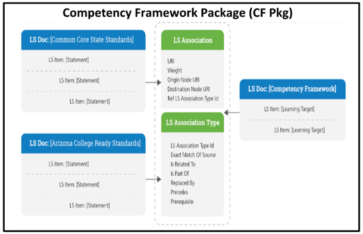
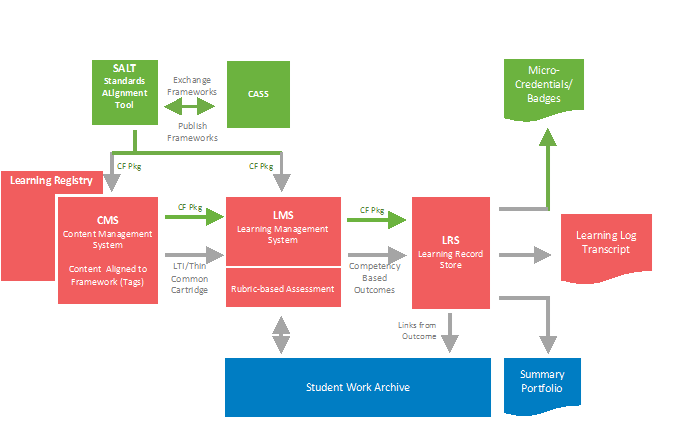
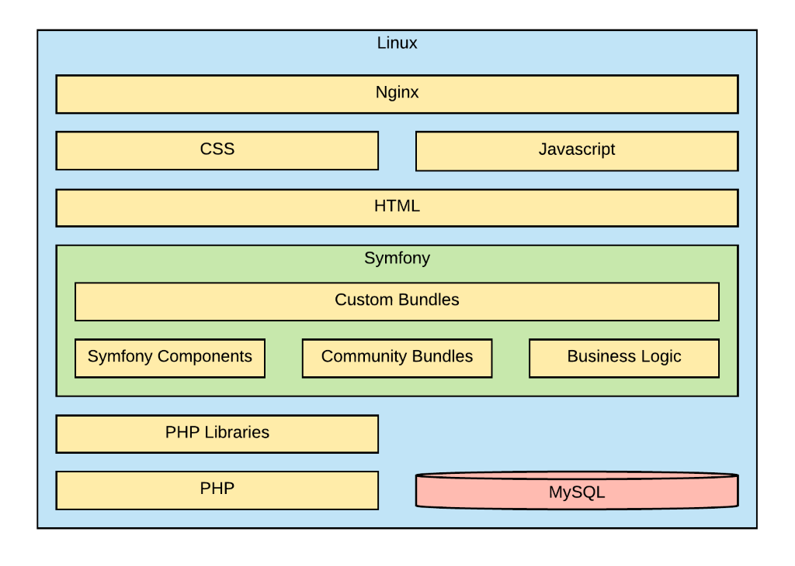
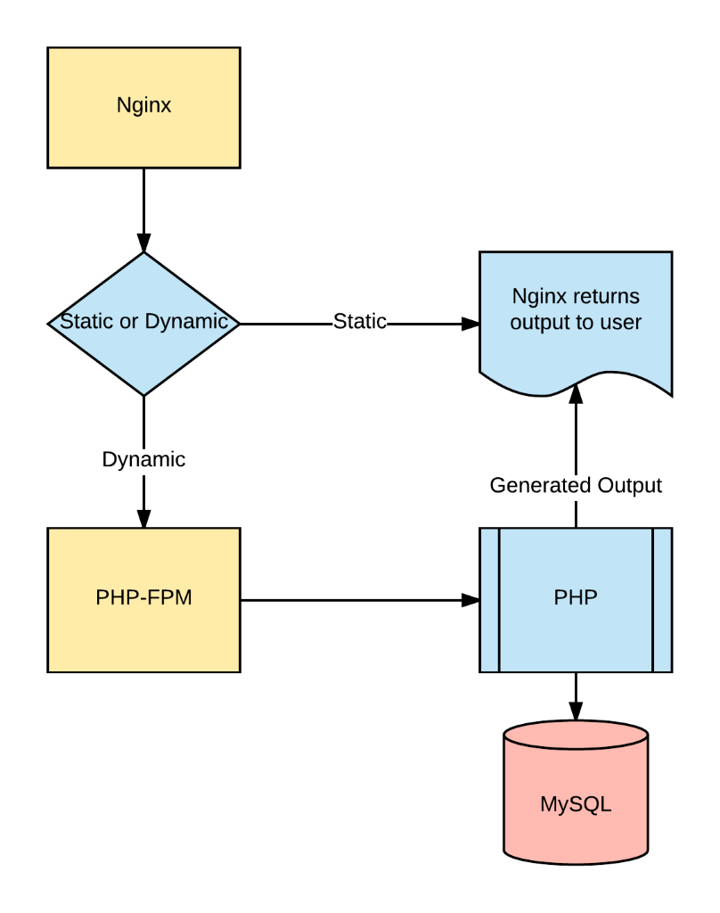

.. _h142f4135472d935617c2d364b11664d:

OpenSALT Developer’s Guide
##########################

| `Functional spec, current state
Technical spec, current state
Installation and configuration
Directions for Extensions
Roadmap	 <#h17234337b517d1c5722503e1c56792c>`_

.. _h4b523d40355645b4e49594064234c68:

Functional spec, current state
==============================

The current state of CASE is located here \ |LINK1|\  

.. _h1c517427c1d6b1f3605564cc53:

Installation and configuration
==============================

.. _h93b1c14423258467d12336a6861605:

Directions for Extensions
==========================

.. _h295144227d69507669363c7b3e543c9:

Roadmap
=======

Architectural Overview 

.. _hd43c255d523b501b345383bc4640:

Definitions of Key Terms 
=========================

+-----------------------------+---------------------------------------------------------------------------------------------------------------------------------------------------------------------------------------------------------------------------------------------------------------------------------------------------------------------------------------------------------------------------------------------------------------------------------------------------------------------------------------------------------------------------------------------------------------------------------------------------------------------------------------------------------------------------------------------------------------------------------------+
|Term                         |Definition                                                                                                                                                                                                                                                                                                                                                                                                                                                                                                                                                                                                                                                                                                                             |
+-----------------------------+---------------------------------------------------------------------------------------------------------------------------------------------------------------------------------------------------------------------------------------------------------------------------------------------------------------------------------------------------------------------------------------------------------------------------------------------------------------------------------------------------------------------------------------------------------------------------------------------------------------------------------------------------------------------------------------------------------------------------------------+
|Competency Framework         |A set of statements created by and articulating skills and/ specific knowledge.  (AKA: Learning Standards, Curriculum Framework, Skills)                                                                                                                                                                                                                                                                                                                                                                                                                                                                                                                                                                                               |
+-----------------------------+---------------------------------------------------------------------------------------------------------------------------------------------------------------------------------------------------------------------------------------------------------------------------------------------------------------------------------------------------------------------------------------------------------------------------------------------------------------------------------------------------------------------------------------------------------------------------------------------------------------------------------------------------------------------------------------------------------------------------------------+
|Standards Setting Entity     |Any entity (education agency, higher education institution, workforce cluster, education service provider, or individual educator)  that sets learning, achievement, or competency standards or targets.                                                                                                                                                                                                                                                                                                                                                                                                                                                                                                                               |
+-----------------------------+---------------------------------------------------------------------------------------------------------------------------------------------------------------------------------------------------------------------------------------------------------------------------------------------------------------------------------------------------------------------------------------------------------------------------------------------------------------------------------------------------------------------------------------------------------------------------------------------------------------------------------------------------------------------------------------------------------------------------------------+
|Conceptual data model        |A representation of the major information, entities, and relationships that exist in the world, without attributes and with relationships shown as one-to-one only.                                                                                                                                                                                                                                                                                                                                                                                                                                                                                                                                                                    |
+-----------------------------+---------------------------------------------------------------------------------------------------------------------------------------------------------------------------------------------------------------------------------------------------------------------------------------------------------------------------------------------------------------------------------------------------------------------------------------------------------------------------------------------------------------------------------------------------------------------------------------------------------------------------------------------------------------------------------------------------------------------------------------+
|Logical Data Model           |Based on the information, entities, and relationships in the conceptual data model, this is a system-agnostic representation that contains attributes, shows cardinality, and uses the commonly-used names for all entities.                                                                                                                                                                                                                                                                                                                                                                                                                                                                                                           |
+-----------------------------+---------------------------------------------------------------------------------------------------------------------------------------------------------------------------------------------------------------------------------------------------------------------------------------------------------------------------------------------------------------------------------------------------------------------------------------------------------------------------------------------------------------------------------------------------------------------------------------------------------------------------------------------------------------------------------------------------------------------------------------+
|Canonical                    |A single source, often the pdf or html that represents the policy approved.                                                                                                                                                                                                                                                                                                                                                                                                                                                                                                                                                                                                                                                            |
+-----------------------------+---------------------------------------------------------------------------------------------------------------------------------------------------------------------------------------------------------------------------------------------------------------------------------------------------------------------------------------------------------------------------------------------------------------------------------------------------------------------------------------------------------------------------------------------------------------------------------------------------------------------------------------------------------------------------------------------------------------------------------------+
|Authoritative                |A source approved by the authorizing agency                                                                                                                                                                                                                                                                                                                                                                                                                                                                                                                                                                                                                                                                                            |
+-----------------------------+---------------------------------------------------------------------------------------------------------------------------------------------------------------------------------------------------------------------------------------------------------------------------------------------------------------------------------------------------------------------------------------------------------------------------------------------------------------------------------------------------------------------------------------------------------------------------------------------------------------------------------------------------------------------------------------------------------------------------------------+
|Trusted                      |While not formally approved by the authorizing agency, it represents the best known source                                                                                                                                                                                                                                                                                                                                                                                                                                                                                                                                                                                                                                             |
+-----------------------------+---------------------------------------------------------------------------------------------------------------------------------------------------------------------------------------------------------------------------------------------------------------------------------------------------------------------------------------------------------------------------------------------------------------------------------------------------------------------------------------------------------------------------------------------------------------------------------------------------------------------------------------------------------------------------------------------------------------------------------------+
|Competency Framework Package |A set of LS Doc, LS Items, and LS Associations released by a standard setting entity                                                                                                                                                                                                                                                                                                                                                                                                                                                                                                                                                                                                                                                   |
+-----------------------------+---------------------------------------------------------------------------------------------------------------------------------------------------------------------------------------------------------------------------------------------------------------------------------------------------------------------------------------------------------------------------------------------------------------------------------------------------------------------------------------------------------------------------------------------------------------------------------------------------------------------------------------------------------------------------------------------------------------------------------------+
|LS Doc                       |A document that acts as a container for a collection of learning standard items, typically arranged in a hierarchical structure or classification scheme, reflecting expectations of learner competencies within a single subject area covering one or more levels.                                                                                                                                                                                                                                                                                                                                                                                                                                                                    |
+-----------------------------+---------------------------------------------------------------------------------------------------------------------------------------------------------------------------------------------------------------------------------------------------------------------------------------------------------------------------------------------------------------------------------------------------------------------------------------------------------------------------------------------------------------------------------------------------------------------------------------------------------------------------------------------------------------------------------------------------------------------------------------+
|LS Item                      |Content that either describes a specific competency (learning objective) or describes a grouping of competencies within the taxonomy of a Learning Standards Document. Educational standards are the learning goals for what students should know and be able to do at each grade level. Education standards, like Common Core are not a curriculum. Local communities and educators choose their own curriculum, which is a detailed plan for day to day teaching. In other words, the Common Core is what students need to know and be able to do, and curriculum is how students will learn it. The Common Core State Standards are educational standards for English language arts (ELA)/literacy and mathematics in grades K-12.  |
+-----------------------------+---------------------------------------------------------------------------------------------------------------------------------------------------------------------------------------------------------------------------------------------------------------------------------------------------------------------------------------------------------------------------------------------------------------------------------------------------------------------------------------------------------------------------------------------------------------------------------------------------------------------------------------------------------------------------------------------------------------------------------------+
|LS Association               |A relationship between two LS Docs or two LS Items that includes:                                                                                                                                                                                                                                                                                                                                                                                                                                                                                                                                                                                                                                                                      |
|                             |                                                                                                                                                                                                                                                                                                                                                                                                                                                                                                                                                                                                                                                                                                                                       |
|                             |Exact Match Of Source, Is Related To, Is Part Of, Replaced By, Precedes, and Prerequisite.                                                                                                                                                                                                                                                                                                                                                                                                                                                                                                                                                                                                                                             |
+-----------------------------+---------------------------------------------------------------------------------------------------------------------------------------------------------------------------------------------------------------------------------------------------------------------------------------------------------------------------------------------------------------------------------------------------------------------------------------------------------------------------------------------------------------------------------------------------------------------------------------------------------------------------------------------------------------------------------------------------------------------------------------+
|Learning Targets             |(AKA LS Item) An entity that specifies the learning that is intended for an individual learner and the success criteria use to indicate progress toward the learning goal. In the formative assessment process a learning goal exists within the framework of a Learning Progression / Competency-based Pathway defined within the context of Learning Standards                                                                                                                                                                                                                                                                                                                                                                       |
+-----------------------------+---------------------------------------------------------------------------------------------------------------------------------------------------------------------------------------------------------------------------------------------------------------------------------------------------------------------------------------------------------------------------------------------------------------------------------------------------------------------------------------------------------------------------------------------------------------------------------------------------------------------------------------------------------------------------------------------------------------------------------------+
|Rubrics                      |An entity that includes information about an instrument used to communicate expectations of quality around a task, product, or performance and/or used to delineate consistent criteria for grading.                                                                                                                                                                                                                                                                                                                                                                                                                                                                                                                                   |
+-----------------------------+---------------------------------------------------------------------------------------------------------------------------------------------------------------------------------------------------------------------------------------------------------------------------------------------------------------------------------------------------------------------------------------------------------------------------------------------------------------------------------------------------------------------------------------------------------------------------------------------------------------------------------------------------------------------------------------------------------------------------------------+

.. _h721512647d633e292e6e1a401867145f:

 
=

.. _h7a6f2e3a7d31506a41137279782e12b:

Assumptions 
------------

Assumptions built into this specification: 

 

#. Context.  In the US, states are required by Federal statute to publish and update K-12 curriculum framework documents, some derived from the Common Core State Standards, some independent.  More generally, education and human capital standard setting entities of all types publish competency frameworks in multiple formats. 

 

#. Competency frameworks are published in html/pdf for humans.  When a framework is adopted and published, it is typically published as pdf or html and need to be translated by 3rd party entities to be used by assessment, content, and learning management systems.   

 

#. Derivative frameworks. These problems are greatly exacerbated by questionable versioning and by the need of school districts, vendors, and individual educators to create derivative frameworks that group, unpack, and extend the original documents to support instruction and assessment.  

 

#. A technical standard is needed.  These translations do not have a standard technical format nor consistent identifiers.  Without a suitable standard, it becomes impossible to tag learning resources so they can be more easily discovered and aligned with competency-based assessment results. 

 

#. Scope of this specification.   What is needed is a standard technical specification and shared technical solution that enables trusted entities to publish Competency Framework Packages that parse learning standard documents (LS Docs) into network resolvable learning standard items (LS Items) that can be associated via hierarchy, progression, and derivation (LS Associations). 

 

#. Global P-20 impact of this specification.	In solving the problem for US K12, we have the opportunity to solve the same problem more broadly for higher ed and international education entities as well as professional certification organizations to establish a common global specification to support the transition to competency-based education as a lifelong learning. 

.. _h721512647d633e292e6e1a401867145f:

 
=

This section describes the software requirements and objectives that have some significant impact on the architecture. 

.. _h721512647d633e292e6e1a401867145f:

 
=

.. _h52f4f1a1014366235d4757803d234e:

Conceptual Model 
=================

#. The conceptual model shows the relationship between a LS Doc and a taxonomy of LS Items.   

 

#. Parent/child relationships within a LS Doc and other relationships are expressed through the LS Association and LS Association Types.  This enables a package to be easily created with all LS Items properly associated with an LS Doc. 

.. _h721512647d633e292e6e1a401867145f:

 
=

.. _h53fa61418423a3093724834f48:

\ |IMG1|\  
===========

.. _h6b37d455b803e172b7d6c594566512:

Figure 1:  Competency Framework Conceptual Model 
=================================================

.. _h721512647d633e292e6e1a401867145f:

 
=

Particularly in US K12, there is a multi-layer, complex taxonomy of education agencies interacting with a marketplace of vendors, each with overlapping layers of authority and organization.  Each Competency Frameworks does not exist in a vacuum.  Data representing the relationship between them is often as important the Competency Framework itself. 

.. _h721512647d633e292e6e1a401867145f:

 
=

.. _h6c19687d6d262f7d27625e356a24297f:

\ |IMG2|\  
===========

.. _h6f624542119622a82e475b2e624b20:

Figure 2: Conceptual Model of Competency-Based Outcome Transcript 
==================================================================

.. _h721512647d633e292e6e1a401867145f:

 
=

.. _h721512647d633e292e6e1a401867145f:

 
=

.. _h3e5c722d65693c745a6778e3721145d:

Use-Case Definition 
====================

The primary use case that this specification seeks to enable education agencies to: 

#. publish data representations of their competency frameworks with alignments to other frameworks 

#. to enable the exchange of one or more Competency Framework Packages from a trusted entity to a new entity (including LMSs, LORs, and assessment systems). 

.. _h154517452b3d19276642da5747c32:

     
=====

.. _h185b5b6012122a3f64233722a11019:

3.0 Technical Considerations 
=============================

.. _h394a7c4b178040361c69185b751e4e:

        Technical Platform 
===========================

The technology used to build SALT is as follows: 

+---------------------------------------------------------------+------------------------------------------------------------------------------------------------------------------------------------------------------------------------------------+-------------------------------------------------------+
|Software Tools                                                 |Tool Functions                                                                                                                                                                      |Technical Specification                                |
+---------------------------------------------------------------+------------------------------------------------------------------------------------------------------------------------------------------------------------------------------------+-------------------------------------------------------+
|The frameworks used in the SALT application include:           |The presentation, service, and business layers are created using Symfony. Bootstrap, custom CSS, and JavaScript are used for the look and functionality of the presentation.        |PHP 7, Symfony 3, Bootstrap 3, JavaScript              |
|                                                               |                                                                                                                                                                                    |                                                       |
|* Symfony                                                      |                                                                                                                                                                                    |                                                       |
|                                                               |                                                                                                                                                                                    |                                                       |
|* Bootstrap                                                    |                                                                                                                                                                                    |                                                       |
+---------------------------------------------------------------+------------------------------------------------------------------------------------------------------------------------------------------------------------------------------------+-------------------------------------------------------+
|The web server components used in the SALT solution include:   |Nginx is used as the exposed web access point.  It then serves static files directly or proxies dynamic requests to PHP-FPM which executes the PHP files.                           |Nginx 1.12, PHP 7 (FPM component)                      |
|                                                               |                                                                                                                                                                                    |                                                       |
|* Nginx                                                        |                                                                                                                                                                                    |                                                       |
|                                                               |                                                                                                                                                                                    |                                                       |
|* PHP-FPM                                                      |                                                                                                                                                                                    |                                                       |
+---------------------------------------------------------------+------------------------------------------------------------------------------------------------------------------------------------------------------------------------------------+-------------------------------------------------------+
|The databases used in the SALT solution include:               |MySQL is used as the primary back-end storage of the lsDoc, lsItem, lsAssociation, and other data.                                                                                  |Percona Server 5.7 (MySQL-compatible server)           |
|                                                               |                                                                                                                                                                                    |                                                       |
|* MySQL                                                        |                                                                                                                                                                                    |                                                       |
+---------------------------------------------------------------+------------------------------------------------------------------------------------------------------------------------------------------------------------------------------------+-------------------------------------------------------+
|The system management tools used in the SALT solution include: |Docker provides a way to separate and isolate the individual components of the system as well as ensuring that each deployment configuration matches the same known and tested set. |Latest version of Docker that is installed by default. |
|                                                               |                                                                                                                                                                                    |                                                       |
|* Docker                                                       |                                                                                                                                                                                    |                                                       |
+---------------------------------------------------------------+------------------------------------------------------------------------------------------------------------------------------------------------------------------------------------+-------------------------------------------------------+

.. _h721512647d633e292e6e1a401867145f:

 
=

The SALT consists of: 

* A user interface using HTML. 

* A service and business layer developed using PHP. 

* A database layer comprising a MySQL database. 

* A file storage layer holding uploaded files on the file system. 

.. _h721512647d633e292e6e1a401867145f:

 
=

.. _h3275453b656d6e7105e16254736239:

Security 
=========

* Different components of the SALT are run in separate Docker containers to keep them isolated. 

* All communication between the users’ browsers and the SALT web interface are encrypted via transport layer security (TLS). 

.. _h721512647d633e292e6e1a401867145f:

 
=

.. _h49d2f79162c4732954546b0407d2c:

Persistence 
============

SALT uses a MySQL database to persist the competency framework information. 

.. _h721512647d633e292e6e1a401867145f:

 
=

.. _h1603040632e263d7d6e3d45526054b:

Reliability/Availability 
=========================

The SALT Portal is available 24 hour a day, 7 days a week, except for periods of scheduled maintenance. 

.. _h721512647d633e292e6e1a401867145f:

 
=

.. _h2e1e60654f24f2a1b6d3c38387e327e:

Architecturally Significant Decisions 
======================================

The SALT consists of: 

* A HTTPS access point using Nginx to serve static files and proxy to the dynamic user interface 

* A user interface developed using HTML5, CSS, and JavaScript rendered using templates and the Symfony full-stack framework 

* A service and business layer developed using the Symfony full-stack framework 

* A database layer comprising a MySQL database 

* Deployment container packaging using Docker 

#. Logical View 

The layering model of SALT Portal is based on a responsibility layering strategy that associates each layer with a particular responsibility.  This strategy has been chosen because it isolates various system responsibilities from one another so that it improves both system development and maintenance. 

Each layer’s specific responsibility is as follows: 

* The presentation layer deals with the presentation logic and the pages that are rendered on SALT site. The presentation layer contains all the components needed to allow interactions with the end-user. 

* The service layer manages the access to the business layer.  The components that form the service layer shield the presentation layer from the details of the business and data layers.   

* The business layer is the part of the system that deals with the performance of business-related tasks.  The business layer contains all the components related to the business logic. 

* The data layer manages access to the database.  The data layer contains all the components that provide access to data stored in a persistent container, such as a database. 

.. _h80796f6531d141926653d426622443a:

\ |IMG3|\ ==========

.. _h2c1d74277104e41780968148427e:

.. _h6e664a75101d36913571c5f10137367:

Implementation View 
====================

.. _h6a7f23367b2f433469314f47392f697a:

\ |IMG4|\ ==========

.. _h66a5a32242926662720431425a2c10:

Testing
=======

To help ensure the stability of the code base, it is highly desired that all features include a full set of automated tests.

.. bottom of content

.. |LINK1| raw:: html

    <a href="http://www.imsglobal.org/case" target="_blank">http://www.imsglobal.org/case</a>

