\ |IMG1|\

OpenSALT v.2.0 - User Manual

\ |STYLE0|\

+---------+------------+-------+-----------------------+----------------+
|Name     |Organization|Date   |Revision Notes         |Document Version|
+=========+============+=======+=======================+================+
|J Kaufman|PCG         |8/2017 |Original Draft for v1.0|.0              |
+---------+------------+-------+-----------------------+----------------+
|BDorman  |ACT         |11/2017|Updating Import Guide  |.1              |
+---------+------------+-------+-----------------------+----------------+
|JMarks   | PCG        |03/2017|OpenSALT v2.0          |.2              |
+---------+------------+-------+-----------------------+----------------+

\ |STYLE1|\

| `Introduction <#hb79795d3e46b47696c7c5b6d3a41e>`_
| `1.0  Audience <#h1911265d3f1258581a361721a6cd74>`_
| `2.0  OpenSALT Structure and Access <#h787f432939517708191470483c5f43>`_
|     `2.1 OpenSALT Structure <#h5064c4520537f221a7341492e6a4025>`_
|     `2.2 OpenSALT Home Page <#h673d3c62a785f726a6b6333444e4b70>`_
|     `2.3 Log into OpenSALT <#ha586e2f5d293a123c76302e1b7822>`_
|     `2.4 Log off from OpenSALT <#h5b52241c7178667e18023622a381f1>`_
| `3.0  User Roles and Permissions <#h1b685a27e68c571dd1c317e122f34>`_
|     `3.1 Super User <#h155d6d5f4916497a1c6b10341f214165>`_
|     `3.2 Super Editor <#h2b5616331387667a40761f394f7b10>`_
|     `3.3 Organization Admin <#h4e2218295d122347968407129336e50>`_
|     `3.4 Organization Editor <#h223559828a7e63152e784375423e27>`_
|     `3.5 Organization Reviewer <#h5ca4f6060522c494356773e1b9d6>`_
|     `3.6 Public User <#h6047727375e794d1cd6e73641d1357>`_
| `4.0 Organization Management <#h6113256bc274e5e44d234a57614658>`_
|     `4.1 Show Organizations <#h2e38184e3252357f696d5953437a1433>`_
|     `4.2 Add/Create Organization <#h3c64e441156177a1577f6b7b1f6b35>`_
|     `4.3 Edit Organization <#h6e6b6c492a472a26603a601b4348370>`_
|     `4.4 Delete Organization <#h2e57757e4b2674d5e64291645c184>`_
| `5.0  User Management <#h80265f116c6c7b4877762ed5412155>`_
|     `5.1 Change Password <#h6d192e6d564f37133d53288be95d>`_
|     `5.2 Manage Users <#h42723a63d41151f712948537a568079>`_
|         `5.2.1 View User <#hfc27428297e2b766e5a37643a705f>`_
|         `5.2.2 Add/Create User <#h146b5979664d766a2a69263e3512862>`_
|         `5.2.3 Show User <#h6e39602150137e754564a16671b646>`_
|         `5.2.4 Edit User <#h6478147d1f4c85e5d62858217e145d>`_
|         `5.2.5 Suspend User <#h1cf396e28322d368416f6957481b1a>`_
|         `5.2.6 Reinstate User <#h4d2e44565174e175b786376651a7d7c>`_
|         `5.2.7 Delete User <#h3c3329734240281c30b512222591212>`_
| `6.0  Framework Management <#h26624554674c365425514b624a121c24>`_
|     `6.1 Navigate and View Frameworks <#h1c4d1853674733a7f15411e4b788>`_
|         `6.1.1 OpenSalt Home / Contents View Page <#h35526e50752d323810506420224185f>`_
|             `6.1.1.1 Public View <#h1a7c6c1a163f6979313e611a1465218>`_
|             `6.1.1.2 Credentialed View <#h7997a7f1949334b7f84a24785861b>`_
|         `6.1.2 Display Frameworks Page <#h715a2b6d63b2a41b18341215f345f>`_
|             `6.1.2.1 Public View <#h473664e5a545502f3e27165c142d>`_
|             `6.1.2.2 Credentialed View <#hb622c455c38115d3972105a6f2f751e>`_
|     `6.2 OpenSALT Frameworks <#h6e1cc76c3a603b3c6b78172573b9>`_
|         `6.2.1 Import Frameworks <#h13a3f4f5767166b3c411a397a2511b>`_
|             `6.2.1.1 Import from ASN <#h3f23193f6633791f3f387f632bb3d54>`_
|             `6.2.1.2 Import CASE-Compliant (JSON) File <#h12b11251a6e4c72563816417b6e593c>`_
|             `6.2.1.2 Import framework from SALT Spreadsheet Template <#h53682f3551661395214da5065d38>`_
|         `6.2.2  Manually Create Frameworks <#h603062394f35362239624c28149787d>`_
|         `6.2.3 Edit Frameworks <#h2a278644e81e7672704d5078541c5>`_
|         `6.2.4 Delete Frameworks <#hf69755472157a75920314a7d7d5a4a>`_
|     `6.3 Framework Items <#h10414a76521969321d1aa7b43555d10>`_
|         `6.3.1 Import Items with OpenSALT Template <#h8523c2e335f3f114642662c4257c>`_
|             `6.3.1.1 CSV Loading Guide for CASE <#h5777746416576973633711c4a42414c>`_
|             `6.3.1.2 Import Process <#h9291733595a7a78664a32f6e6f6f12>`_
|             `6.3.1.3  Error Log <#h23320351bb10619415c7276b33c>`_
|         `6.3.2 HTML Formatting <#h117048805776102d7a113720452f3f0>`_
|         `6.3.2 Create Items Manually <#h757c75c270717938461c1778456b40>`_
|         `6.3.3 Parent vs Child Items <#hee11494ea5a737422533f4857a34>`_
|         `6.3.4 Edit Items <#h34582e2c50517f447c3367b591218>`_
|             `6.3.4.1 Edit Item Content <#h11415a1c7a7424802ff154b3f2252>`_
|             `6.3.4.2 Edit Item Positions <#h6e264f53772d28c3a845e5e2246>`_
|         `6.3.5 Delete Items <#h1b3dd616c45b553829304021334350>`_
|             `6.3.5.1 Delete Child Item <#h2f4b7d7a715b621354f7a54d243844>`_
|             `6.3.5.2 Delete Parent Item <#h6a5c563e12623b7a81e2b634f8569>`_
|     `6.4 Exemplars for Items <#h417d2d687a6e463a4f2e12321e305c68>`_
|         `6.4.1 Add Exemplar <#h1f2d7057546c742f477446913652e37>`_
|         `6.4.2 Delete Exemplar <#h121a4c79224b7fc925545a2e64286f>`_
|     `6.5 Derivative Frameworks - Copy Items <#h38345071571251147d64497174403132>`_
|     `6.6 Association Management <#h3130761b154e2b57715e7f2385a5548>`_
|         `6.6.1 Associations <#h7529305c281925361d6f9354e774716>`_
|             `6.6.1.1 Create Associations <#h2558124e33f4e6a415f47d675f2742>`_
|             `6.6.1.2 Edit Associations <#h29645036134039768f4f2c4457652d>`_
|             `6.6.1.2 Delete Associations <#h3465b16792e30151f3c47675d20f4c>`_
|                 `6.6.1.2.1 Delete Associations from Tree View <#h1d2176383b1f54c754861c1758301b>`_
|                 `6.6.1.2.2 Delete Associations from Association View <#h111d2e1478713d77723970494749152>`_
|         `6.6.2 Association Groups <#h48482a61264d7437205d1a12f3f3d6b>`_
|         `6.6.3 Crosswalk Associations <#h6fe4164b12672914514d4f13492564>`_
|             `6.6.3.1 Create Crosswalk Associations <#h3123662d575a5b54732475fd62e>`_
|             `6.6.3.2 Edit Crosswalk Associations <#h0571ea6415539114494f5a71425a>`_
|             `6.6.3.3 Delete Crosswalk Associations <#h5d772b55c793e1c441729195453c14>`_
|     `6.7 Export Frameworks Packages <#h4f5432411f2146301151697341562b46>`_
|         `6.7.1 Export Competency Framework Package (JSON) File <#h163e401e8291001a4c5447e45136c>`_
|         `6.7.2 Export Styled PDF (Future Function) <#h69105f5c3a80644f6a806369c586458>`_
|         `6.7.3 Export Spreadsheet <#h596b20112477664e57757b30727b58>`_
|             `6.7.3.1 CF Doc Tab <#h2c3d432f26522266f31614d703c15b>`_
|             `6.7.3.2 CF Item Tab <#h495651a32261e342218226c7b239>`_
|             `6.7.3.3 CF Association Tab <#h7a453f1eb35d645b3d574c4e4a2552>`_
|         `6.7.4 Export HTML Archive (Future Function) <#h637197e5b246b4c3f7c222d352d67>`_
|         `6.7.5 Link for Browser View <#h74c126565a611e731014cb6b8>`_
| `7.0 Options <#h3e237e1a4d5b2d787d76433f407b725f>`_
|     `7.1 Commenting Module <#h366f59222a45735257254b1927547c6a>`_
|     `7.2. Features <#h2e1e53322a7678fc1a293916464311>`_
|     `7.3 Viewing Comments <#hf2b15673b1ad53c735328544e7e1d>`_
|     `7.4 Commenting Configuration <#h5cc5056584c262f761b5b2746a346b>`_

.. _hb79795d3e46b47696c7c5b6d3a41e:

Introduction
============

\ |STYLE2|\

CASE establishes a new, global technical standard for the exchange of machine readable, linked data versions of state and national academic standards, local learning objectives and targets, or any workplace, military, or higher education competencies representing skills, knowledge, or abilities. To learn more please visit: \ |LINK1|\

\ |STYLE3|\

To support CASE, PCG Education (A national public sector consulting practice); ACT Inc and SchoolCity (both leading curriculum and assessment providers), partnered on the development of the open source project called OpenSALT, that provides a free, IMS-conformance certified tool that enables education organizations to manage and publish frameworks and crosswalks to other standards.

Developed as an open source project, OpenSALT provides for easy exchange of state standards data and provides for and enables alignment services to align educational content to learning standards, as well as correlate (Crosswalk) between different state standards and competency frameworks.

\ |STYLE4|\

* Easily create derivative frameworks from national standards for use within States

* Create customized competency frameworks with connections to national and state frameworks as needed

* Set learning progressions within a framework

* Allow different views of a framework (For example, view the Standards of Engineering Practices in the NGSS framework separately from the DCI statements)

* Filter frameworks by keyword

* Enabled for the common alignment of resources and assessments to standards

* A Consistent digital format that can be easily integrated into ed-tech products and internal documents alike (Export to the standardized CASE Format as well as spreadsheets)

.. _h1911265d3f1258581a361721a6cd74:

1.0  Audience
=============

This document is intended as a complete guide for using OpenSALT. This document is specially designed for all users with advanced permissions or non-specialists who may find the document useful as a  point of reference. By reading this guide, you will learn how to use OpenSALT through the elements of the graphical user interface (GUI) and explanations of some of the advanced features to provide best practices. This guide will help you to navigate and easily use OpenSALT. The functions and features described in this guide will indicate any role restrictions or limitations as to what users can access or interact with the given system function.

.. _h486792f4a12b6443784e11c1032c:

1.1 Platform Requirements
-------------------------

The user interface is designed using current web standards and supports most modern browsers, in their current supported versions, on a variety of desktop and mobile devices.

The user interface requires JavaScript to be enabled and internet access to be available (no support for an offline mode is currently available).

The user interface should support the latest versions of the following web browsers on desktop and mobile devices:

* Chrome

* Internet Explorer

* Edge

* Safari

* Firefox

.. _h556146c2387114251125619317e27:

2.0  OpenSALT Structure and Access
===================================

OpenSALT is designed to be an open, publicly accessible, framework site that allows transparency in frameworks and crosswalks. By design users are able to traverse and view the published frameworks and content by accessing the main url for the given site. OpenSALT then utilizes a login that allows provisioned users to create, edit and otherwise interact with the frameworks for the site.

.. _h5064c4520537f221a7341492e6a4025:

2.1 OpenSALT Structure
----------------------

OpenSALT goes to the home page by default, and also has a document tree view. The Doc Tree View shows a framework and information about the framework on the right hand side, where logged in users with proper permissions can edit items, associate with other framework items, and copy other framework items into the current framework.

.. _h673d3c62a785f726a6b6333444e4b70:

2.2 OpenSALT Home Page
----------------------

The image below is an example of an OpenSALT site, OpenSALT.net hosted by PCG. When user launches opensalt.net in a browser, the user is presented with the open view of the site.

\ |IMG2|\

This is a view of an OpenSALT site hosted by ACT, located at frameworks.act.org

\ |IMG3|\

All public, non-provisioned users are able to view the frameworks and content with each form this view. Navigating the frameworks will be further discussed in a later section of this document.

.. _h6a553f521677b3b627ff294828321:

2.3 Log into OpenSALT
----------------------

For provisioned users the \ |STYLE5|\  button will launch a login screen that will enable deeper system usage and open up available menus for further interaction with OpenSALT.

\ |IMG4|\

Provisioned users can enter in their \ |STYLE6|\  (user’s email) and \ |STYLE7|\  then click the \ |STYLE8|\  button to access the admin functions for OpenSALT.

\ |IMG5|\

After logging in a provisioned user will now see the \ |STYLE9|\  button replaced by “Signed in as \ |STYLE10|\ ” (email) with a menu icon  and two new buttons on the main frame of the page:  \ |STYLE11|\  and \ |STYLE12|\

.. _h5b52241c7178667e18023622a381f1:

2.4 Log off from OpenSALT
-------------------------

All provisioned users should log out of OpenSALT when finished with their session. To logout, click on the expansion menu next to the user name and select \ |STYLE13|\ .

\ |IMG6|\

.. _h1b685a27e68c571dd1c317e122f34:

3.0  User Roles and Permissions
===============================

OpenSALT currently has five user roles with specified permissions for the tool:

#. Super User

#. Super Editor

#. Organization Administrator

#. Organization Editor

#. Organization Reviewer (Account in org but no role)

#. Public (non-authenticated)

The Chart below provides an overview of the users and their provisioned roles and detailed descriptions follow.

\ |IMG7|\

.. _h155d6d5f4916497a1c6b10341f214165:

3.1 Super User
--------------

This is the top level in the user hierarchy for OpenSALT. A Super User has full permissions to the site and can create and manage organizations, manage users across all organizations, and manage all frameworks and content across all organizations.

* view any framework

* download (export) any framework in \ |STYLE14|\  or \ |STYLE15|\  modes

* change their password

* add new, import, and edit frameworks in all organizations:

    * Personal frameworks

        * only editable by the creator (by default)

        * access can be granted to other editors to edit the framework

    * Organizational  frameworks

        * editable by all editors/admins in the organization (by default), this includes Super Editors and Super Admins

        * can edit frameworks which they have permission to edit:

            * frameworks owned by any organization

            * other frameworks where the user has been explicitly been granted edit access

        * alter edit access to any frameworks

        * assign ownership of any personal framework created by an editor in any organization

* manage organizations in OpenSALT

    * add organizations

    * edit organizations

    * delete organizations

* add users to any organization (Super User, Super Editor, Organization Admin or Organization Editor)

    * suspend users in any organization (Super User, Super Editor, Organization Admin or Organization Editor)

    * unsuspend users in any organization (Super User, Super Editor, Organization Admin or Organization Editor)

* Note the Super Users cannot be excluded from edit access to a framework

.. _h2b5616331387667a40761f394f7b10:

3.2 Super Editor
----------------

Much like the Super User, the Super Editor has has permissions to work across organizations however this user is only permitted to manage all frameworks and content across all organizations. The Super Editor has no access to manage organizations, nor users.

The Organization Admin can manage users for their given organization, and manage and manage all frameworks and content for only their organization.

* view any framework

* download (export) any framework in \ |STYLE16|\  or \ |STYLE17|\  modes

* change their password

* add new, import, and edit frameworks in all organizations:

    * Personal frameworks

        * only editable by the creator (by default)

        * access can be granted to other editors to edit the framework

    * Organizational  frameworks

        * editable by all editors/admins in the organization (by default), this includes Super Editors and Super Admins

        * can edit frameworks which they have permission to edit:

            * frameworks owned by any organization

            * other frameworks where the user has been explicitly been granted edit access

        * alter edit access to any frameworks

        * assign ownership of any personal framework created by an editor in any organization

* Note the Super Editor cannot be excluded from edit access to a framework

.. _h4e2218295d122347968407129336e50:

3.3 Organization Admin
----------------------

The Organization Admin can manage users for their given organization, and manage and manage all frameworks and content for only their organization.

* view any framework

* download (export) any framework in \ |STYLE18|\  or \ |STYLE19|\  modes

* change their password

* add new, import, and edit frameworks:

    * Personal frameworks

        * only editable by the creator (by default)

        * access can be granted to other editors to edit the framework

    * Organizational  frameworks

        * editable by all editors/admins in the organization (by default), this includes Super Editors and Super Admins

        * can edit frameworks which they have permission to edit:

            * frameworks owned by their organization open to all editors (no exclusions)

            * frameworks owned by their organization when the user is not in the exclusion list

            * other frameworks where the user has been explicitly been granted edit access

        * alter edit access to any frameworks owned by their organisation (personal frameworks)

        * assign ownership of any personal framework created by an editor in their organization

* add users to their organization (Organization Admin or Organization Editor)

    * suspend users in their organization (Organization Admin or Organization Editor)

    * unsuspend users in their organization (Organization Admin or Organization Editor)

.. _h223559828a7e63152e784375423e27:

3.4 Organization Editor
-----------------------

The Organization Editor has only access to its respective organization and is only permitted to manage frameworks and content with the assigned organization. An Organization Editor has no access to manage organizations, nor users. An Organization Editor can:

* view any framework

* download (export) any framework in \ |STYLE20|\  or \ |STYLE21|\  modes

* change their password

* add new frameworks and import frameworks:

    * Personal frameworks

        * only editable by the creator (by default)

        * access can be granted to other editors to edit the framework

    * Organizational  frameworks

        * editable by all editors/admins in the organization (by default), this includes Super Editors and Super Admins

        * can edit frameworks which they have permission to edit:

            * frameworks owned by their organization open to all editors (no exclusions)

            * frameworks owned by their organization when the user is not in the exclusion list

            * other frameworks where the user has been explicitly been granted edit access

.. _h5ca4f6060522c494356773e1b9d6:

3.5 Organization Reviewer
-------------------------

The Organization Reviewer is an org member with no roles assigned. They can log in and access private draft frameworks in an organization. They can not edit or manage frameworks. An Organization Reviewer can:

* view any framework in an org, private or not

* download (export) any framework in \ |STYLE22|\  or \ |STYLE23|\  modes

* change their password

* Add comments if comments are turned on

* They can \ |STYLE24|\  make personal frameworks.

.. _h6047727375e794d1cd6e73641d1357:

3.6 Public User
---------------

The Public User is the default user for all who visit an OpenSALT site. This user has no provisioned credentials and therefore cannot log into the site to access administrative functionality Rather this user is able to navigate the published frameworks and content and has read-only rights to the information. The Public User can:

* view any framework

* download (export) any framework in \ |STYLE25|\  or \ |STYLE26|\  modes

.. _h6113256bc274e5e44d234a57614658:

4.0 Organization Management
===========================

\ |STYLE27|\

As discussed in section 2.1 Open SALT is designed to b a multi-tenant environment housing multiple organizations and users, though keeping all securely separated. In order to establish the separation, the Super User will need to create and manage organizations.

To access the \ |STYLE28|\  page, after logging in the user should click the triangular menu icon next to their user name in the header of the page. The menu will expand with several options depending on the user’s role. Click on \ |STYLE29|\  to open the page.

\ |IMG8|\

The \ |STYLE30|\   is the default page displayed when a Super User accesses the \ |STYLE31|\  function of OpenSALT. The list will display all organizations that the are currently in the given instance of OpenSALT. The \ |STYLE32|\  provides the OpenSALT unique ID number, the Organization Name, and Actions for the organizations (\ |STYLE33|\  and \ |STYLE34|\ ). The page also has a button to \ |STYLE35|\ .

\ |IMG9|\

.. _h2e38184e3252357f696d5953437a1433:

4.1 Show Organizations
----------------------

There are two ways to view an individual organization’s information beyond the \ |STYLE36|\   table view.

#. On the \ |STYLE37|\  click on the linked \ |STYLE38|\  number for the selected organization.

\ |IMG10|\

#. On the \ |STYLE39|\  click on the \ |STYLE40|\  button in the \ |STYLE41|\  section of the Organization table for the selected organization.

\ |IMG11|\

The \ |STYLE42|\  screen will display for the selected user.

\ |IMG12|\

The Super User can see the Organization’s unique ID value and the Organization’s name.

From the \ |STYLE43|\  screen the Super User can:

* return the \ |STYLE44|\  by clicking the \ |STYLE45|\

* edit the organization by clicking on the \ |STYLE46|\  button

* delete the organization by clicking on the \ |STYLE47|\  button

.. _h3c64e441156177a1577f6b7b1f6b35:

4.2 Add/Create Organization
---------------------------

To create a new user, click on the \ |STYLE48|\  button at the bottom right of the \ |STYLE49|\ .

\ |IMG13|\

The Add an Organization page will display:

\ |IMG14|\

The admin will need to enter in the following required fields:

    \ |STYLE50|\  Type the Organization name

Then click on the \ |STYLE51|\  button to create the organization.

If the Admin wants to cancel, and not create the organization, click the \ |STYLE52|\  button.

.. _h6e6b6c492a472a26603a601b4348370:

4.3 Edit Organization
---------------------

An Admin can access the \ |STYLE53|\  screen using two paths:

#. On the \ |STYLE54|\  click on the \ |STYLE55|\  button in the \ |STYLE56|\  section of the Organization table for the selected organization. \ |IMG15|\

#. On the \ |STYLE57|\  screen click on the \ |STYLE58|\  button.

\ |IMG16|\

The \ |STYLE59|\  screen will display and allow the Admin to update the user’s information.

\ |IMG17|\ The Admin can update/correct the following field:

    \ |STYLE60|\  Type the Organization name

Then click on the \ |STYLE61|\  button to save the changes.

If the Admin wants to cancel, and not edit the the organization, click the \ |STYLE62|\  button.

The Admin can also delete the organization from this screen by clicking on the \ |STYLE63|\  button.

.. _h2e57757e4b2674d5e64291645c184:

4.4 Delete Organization
-----------------------

If an organization  needs to be completed removed from OpenSALT, the Admin should delete the organization. There are two methods to delete an organization.

#. From the \ |STYLE64|\  click on the \ |STYLE65|\  button for the selected organization. The \ |STYLE66|\  page will be displayed and the Admin can click the \ |STYLE67|\  button to terminate the organization. Once deleted the organization cannot be restored. If the organization is needed, the Admin will need to create a new organization.

\ |IMG18|\

#. From the \ |STYLE68|\  click on the \ |STYLE69|\  button for the selected organization. The \ |STYLE70|\  page will be displayed and the Admin can click the \ |STYLE71|\  button to terminate the organization. Once deleted the organization cannot be restored. If the organization is needed, the Admin will need to create a new organization.

\ |IMG19|\

.. _h80265f116c6c7b4877762ed5412155:

5.0  User Management
====================

.. _h6d192e6d564f37133d53288be95d:

5.1 Change Password
-------------------

\ |STYLE72|\

All provisioned users have the ability to change their password from the temporary one created by the Admin or as part of a good practice to regularly update their password to maintain a good security protocol.

To access the \ |STYLE73|\  page, after logging in the user should click the triangular menu icon next to their user name in the header of the page. The menu will expand with several options depending on the user’s role. However all provisioned users will have the menu option: \ |STYLE74|\ . Click on \ |STYLE75|\  to open the page.

\ |IMG20|\

On the \ |STYLE76|\  page the user will enter in the following required fields:

\ |IMG21|\

    \ |STYLE77|\  Existing current password

    \ |STYLE78|\  Newly selected password

    \ |STYLE79|\  Re-type the newly selected password

    The user will then click the \ |STYLE80|\  button.

If the entered values validate as correct, the old password is equal to the user’s current password and the new and repeat passwords are the same, the system will change the user's password to the newly selected value. If alny of the data is not validated, the system will prompt the user to correct the information before the change password can be completed.

.. _h42723a63d41151f712948537a568079:

5.2 Manage Users
----------------

\ |STYLE81|\

User account management is controlled by the Super Users and the Organization Admins. To access the \ |STYLE82|\  page, after logging in the user should click the triangular menu icon next to their user name in the header of the page. Click on \ |STYLE83|\  to open the page.

\ |IMG22|\

.. _hfc27428297e2b766e5a37643a705f:

5.2.1 View User
~~~~~~~~~~~~~~~

\ |STYLE84|\

The \ |STYLE85|\  is the default page displayed when a Super User or Organization Admin accesses the \ |STYLE86|\  function of OpenSALT. The list will display all users that the are currently in the given instance of OpenSALT. Super Users will see all users in all organizations, whereas Organization Admins will only see the users within their organization.  The User List will display the OpenSALT unique ID for the user (as system generated incremented number), the Organization the user belongs to, the Username (email) The user's role, and available actions (\ |STYLE87|\ , \ |STYLE88|\ , \ |STYLE89|\ ) for the user. The page also has a button to \ |STYLE90|\ .

\ |IMG23|\

.. _h146b5979664d766a2a69263e3512862:

5.2.2 Add/Create User
~~~~~~~~~~~~~~~~~~~~~

\ |STYLE91|\

To create a new user, click on the \ |STYLE92|\  button at the bottom right of the \ |STYLE93|\ .

\ |IMG24|\

The \ |STYLE94|\  page will display:

\ |IMG25|\

The admin will need to enter in the following required fields:

    \ |STYLE95|\ : Type the user’s email address

    Password: Type in a temporary password for the user. This password will not be viewable after creating the user. The Admin needs to take note of the temporary password entered to share with the user and the user will need to enter this password to change their password to a non-temporary secure password.

    \ |STYLE96|\ : Select one role for the user and check the box accordingly

    \ |STYLE97|\ : Select the user’s organization (note Organization Admins will only have their organization displayed, whereas Super Users will see all Organizations within the given OpenSALT site)

Then click on the \ |STYLE98|\  button to create the user.

If the Admin wants to cancel, and not create the user, click the \ |STYLE99|\  button.

.. _h6e39602150137e754564a16671b646:

5.2.3 Show User
~~~~~~~~~~~~~~~

\ |STYLE100|\

There are two ways to view an individual user’s information beyond the \ |STYLE101|\  table view.

#. On the \ |STYLE102|\  click on the linked \ |STYLE103|\  number for the selected user.

\ |IMG26|\

#. On the \ |STYLE104|\  click on the \ |STYLE105|\  button in the \ |STYLE106|\  section of the User table for the selected user. \ |IMG27|\

The \ |STYLE107|\  screen will display for the selected user.

\ |IMG28|\

The Super User or Organization Admin can see the user’s Organization, Username, and assigned Role.

From the \ |STYLE108|\  screen the Admin can:

*  return the \ |STYLE109|\  by clicking the \ |STYLE110|\

* edit the user by clicking on the \ |STYLE111|\  button

* delete the user by clicking on the \ |STYLE112|\  button

.. _h6478147d1f4c85e5d62858217e145d:

5.2.4 Edit User
~~~~~~~~~~~~~~~

\ |STYLE113|\

An Admin can access the \ |STYLE114|\  screen using two paths:

#. On the \ |STYLE115|\  click on the \ |STYLE116|\  button in the \ |STYLE117|\  section of the User table for the selected user. \ |IMG29|\

#. On the \ |STYLE118|\  screen click on the \ |STYLE119|\  button.

\ |IMG30|\

The \ |STYLE120|\  screen will display and allow the Admin to update the user’s information.

\ |IMG31|\  The Admin can update/correct the following fields:

    \ |STYLE121|\ : If needed, type the user’s new email address. This will change the username that is entered when the user logs in.

    Password: If needed, type in a new temporary password for the user. This password will not be viewable after creating the user. The Admin needs to take note of the temporary password entered to share with the user and the user will need to enter this password to change their password to a non-temporary secure password.

    \ |STYLE122|\ : If needed, select a new role for the user and uncheck the previous role.

    \ |STYLE123|\ : If needed, change the organization Select the user’s organization (note Organization Admins will only have their organization displayed, whereas Super Users will see all Organizations within the given OpenSALT site)

Then click on the \ |STYLE124|\  button to save the changes.

If the Admin wants to cancel, and not edit the the user, click the \ |STYLE125|\  button.

The Admin can also \ |STYLE126|\  the user from this screen by clicking on the \ |STYLE127|\  button.

.. _h1cf396e28322d368416f6957481b1a:

5.2.5 Suspend User
~~~~~~~~~~~~~~~~~~

\ |STYLE128|\

If an admin needs to prevent the user from accessing the OpenSALT instance, but needs to maintain the user’s account  in the system ,the admin can \ |STYLE129|\  the user’s account.

To suspend an account the Admin will need to be on the User List page and select the \ |STYLE130|\  button for the selected user.

\ |IMG32|\

After clicking on the \ |STYLE131|\  button, the user will be immediately suspended. The \ |STYLE132|\  is updated to reflect the suspension and the account can now only be viewed through the \ |STYLE133|\  button or unsuspended with the \ |STYLE134|\  button.

\ |IMG33|\

.. _h4d2e44565174e175b786376651a7d7c:

5.2.6 Reinstate User
~~~~~~~~~~~~~~~~~~~~

\ |STYLE135|\

To reinstate a user’s account the Admin will access the \ |STYLE136|\  and click on the \ |STYLE137|\  button for the selected user. The \ |STYLE138|\  will update and the account will be immediately unsuspended and the user can log in with the original credentials. If the user needs to have their password reset, the Admin can the edit the user by clicking the \ |STYLE139|\  button for the selected user and updated the password.

\ |IMG34|\

.. _h3c3329734240281c30b512222591212:

5.2.7 Delete User
~~~~~~~~~~~~~~~~~

\ |STYLE140|\

If a user needs to be completed removed from OpenSALT, the Admin should delete the user. There are two methods to delete a user.

#. From the \ |STYLE141|\  click on the \ |STYLE142|\  button for the selected user. The \ |STYLE143|\  page will be displayed and the Admin can click the \ |STYLE144|\  button to terminate the user account. Once deleted the account cannot be restored. If the account is needed, the Admin will need to create a new user account.

\ |IMG35|\

#. From the \ |STYLE145|\  click on the \ |STYLE146|\  button for the selected user. The \ |STYLE147|\  page will be displayed and the Admin can click the \ |STYLE148|\  button to terminate the user account. Once deleted the account cannot be restored. If the account is needed, the Admin will need to create a new user account.

\ |IMG36|\

.. _h26624554674c365425514b624a121c24:

6.0  Framework Management
=========================

.. _h1c4d1853674733a7f15411e4b788:

6.1 Navigate and View Frameworks
--------------------------------

OpenSALT is designed to be a simple application with few UI screens. The Application has two (2) primary screens for users to view and manger Frameworks and items:

#.  OpenSalt Home / Contents View Page

#. Framework Display Page

.. _h35526e50752d323810506420224185f:

6.1.1 OpenSalt Home / Contents View Page
~~~~~~~~~~~~~~~~~~~~~~~~~~~~~~~~~~~~~~~~

.. _h1a7c6c1a163f6979313e611a1465218:

6.1.1.1 Public View
^^^^^^^^^^^^^^^^^^^

When a  user launches an OpenSALT instance through their browser they will reach the Public view of the OpenSALT site. The following images represent a few of the current OpenSALT sites in operation.

\ |IMG37|\

\ |IMG38|\

\ |IMG39|\

\ |IMG40|\

Note the default view has consistency from site to site. The variation is in the organization’s ability to add their organization logo and the content of the frameworks in the list.

Public users can view all Organizations with Draft and Adopted Frameworks on the OpenSALT site.

The default view is for all of the Organizations to be listed and their frameworks to be collapsed.

\ |IMG41|\

The user can expand the ORganizations to see all available Frameworks by clicking on either the arrow to the left of the Organization name or on the name itself.

\ |IMG42|\

.. _h7997a7f1949334b7f84a24785861b:

6.1.1.2 Credentialed View
^^^^^^^^^^^^^^^^^^^^^^^^^

If a user has credentials and logs into OpenSALT they will have additional buttons on this page, depending on their role and permissions. Additionally they will be able to see all frameworks that are in a Private Draft status as well.

\ |IMG43|\

.. _h715a2b6d63b2a41b18341215f345f:

6.1.2 Display Frameworks Page
~~~~~~~~~~~~~~~~~~~~~~~~~~~~~

When a user click on a framework on the \ |STYLE149|\  OpenSALT will open the \ |STYLE150|\  page for the select framework.

.. _h473664e5a545502f3e27165c142d:

6.1.2.1 Public View
^^^^^^^^^^^^^^^^^^^

\ |IMG44|\

As a user clicks on a framework item, the Item Details frame will update to reflect the specifics for the selected item.

\ |IMG45|\

.. _hb622c455c38115d3972105a6f2f751e:

6.1.2.2 Credentialed View
^^^^^^^^^^^^^^^^^^^^^^^^^

Credentialed users will have additional administrative controls and functions on the Display Framework page, depending on their role and permissions.

\ |IMG46|\

.. _h2c1d74277104e41780968148427e:

.. _h6e1cc76c3a603b3c6b78172573b9:

6.2 OpenSALT Frameworks
-----------------------

.. _h13a3f4f5767166b3c411a397a2511b:

6.2.1 Import Frameworks
~~~~~~~~~~~~~~~~~~~~~~~

\ |STYLE151|\

OpenSALT has two methods for importing in an existing CASE-compliant framework into the site.

#. Import from ASN

#. Import CASE-compliant file (JSON)

To import data the user must first log into OpenSALT. After login, the \ |STYLE152|\  button will be displayed at the top of the screen.

\ |IMG47|\

Click on the \ |STYLE153|\  button to open the \ |STYLE154|\  window.  From this window the user can either \ |STYLE155|\  or \ |STYLE156|\  \ |STYLE157|\  \ |STYLE158|\  using the provided template.

\ |IMG48|\

.. _h3f23193f6633791f3f387f632bb3d54:

6.2.1.1 Import from ASN
^^^^^^^^^^^^^^^^^^^^^^^

Achievement Standards Network (ASN), powered by D2L, is a collection of machine-readable representations of learning objectives. ASN was created through funding by the \ |LINK2|\  and the \ |LINK3|\  and is now owned and operated by D2L. This source can provide users with a starting foundation for creating meaningful CASE-compliant frameworks. However the data in ASN may not be current nor accurate and complete. It is up to the individual users and organizations to determine the accuracy of any imported data into OpenSALT. However because of the ability to provide a good starting point for Frameworks content in OpenSALT, the application allows users to do a direct import from a given ASN url.

In a seperate browser window or tab navigate to ASN’s Standards: \ |LINK4|\ .

Select the correct Jurisdiction or Publishing Organization of Framework to be imported.

\ |IMG49|\

Click on the Framework Document to be imported.

\ |IMG50|\

When the ASN Framework Page displays, copy the URL in the browser window (Or just the ID number at the end), and return to your OpenSALT tab.

\ |IMG51|\

On the \ |STYLE159|\  window, paste the \ |STYLE160|\  into the box on the \ |STYLE161|\  \ |STYLE162|\  Then click \ |STYLE163|\ .

\ |IMG52|\

If you do not want to import a framework, click on the Close button to return to the \ |STYLE164|\  page.

A new publisher will be created named: \ |STYLE165|\ . When expanded, the imported Framework will be displayed.

\ |IMG53|\

When a Framework package is imported from ASN, the default for the \ |STYLE166|\  will be ‘\ |STYLE167|\ ’. and the \ |STYLE168|\  will be blank. When an \ |STYLE169|\  is blank, the Framework package is by default publicly visible on the OpenSALT instance. However because the ASN data should be validated, the best practice is for the user that imported the Framework package to edit the Framework details and update both the \ |STYLE170|\  and the \ |STYLE171|\  values after the import from ASN.

To edit the \ |STYLE172|\  and \ |STYLE173|\  fields, expand the \ |STYLE174|\  and click on the newly imported \ |STYLE175|\ .

\ |IMG54|\

On the \ |STYLE176|\  page, click on the \ |STYLE177|\  button in the \ |STYLE178|\ .

\ |IMG55|\

The \ |STYLE179|\  window will open and allow the user to update the necessary fields.

The user may want to change the value in the \ |STYLE180|\  field from ‘\ |STYLE181|\ ’ to the source organization. In this example the source \ |STYLE182|\  is \ |STYLE183|\ .

Additionally the user should change the \ |STYLE184|\  to either \ |STYLE185|\  or \ |STYLE186|\ . \ |STYLE187|\  will allow the Framework to be visibly by all users, including the Public user thought it will let user know that the Framework is still being reviewed and is not yet ready to be \ |STYLE188|\ . \ |STYLE189|\  will hide the Framework from the Public users until the Editor or Admin is ready to change the stats to make it available for others to see.

\ |IMG56|\ \ |IMG57|\

To \ |STYLE190|\  the updated, click the \ |STYLE191|\  button.

To \ |STYLE192|\  and abandon any changes, click the \ |STYLE193|\  button.

Further information on \ |STYLE194|\  is explained the previous section \ |LINK5|\ .

.. _h492d5a3a552796702d752a28184f16:

6.2.1.2 Import CASE-Compliant (JSON) File
^^^^^^^^^^^^^^^^^^^^^^^^^^^^^^^^^^^^^^^^^^

OpenSALT allows users to import known CASE-compliant framework files into the system. Click on the \ |STYLE195|\  tab in the  \ |STYLE196|\  window. Then click \ |STYLE197|\

\ |IMG58|\

Navigate on your computer to the correct Case-compliant JSON file to import then  click \ |STYLE198|\ .

\ |IMG59|\

The filename will display in the Choose File box, then click the \ |STYLE199|\  button to import the framework.

\ |IMG60|\

To cancel the action and not import the file, click on the \ |STYLE200|\  button.

.. _h0203b6f35784a134519337c451c6f5c:

6.2.1.2 Import framework from SALT Spreadsheet Template
^^^^^^^^^^^^^^^^^^^^^^^^^^^^^^^^^^^^^^^^^^^^^^^^^^^^^^^^

[Content Pending 1.2 Version]

.. _h1d5d104a7b4f6a7c4a7715d503b1470:

6.2.2  Manually Create Frameworks
~~~~~~~~~~~~~~~~~~~~~~~~~~~~~~~~~~

\ |STYLE201|\

To Create a \ |STYLE202|\  manually the credentialed user will click on the Create a new Framework button on the \ |STYLE203|\  after logging into OpenSALT.

\ |IMG61|\

On the \ |STYLE204|\  page, completed at a minimum the mandatory fields, though all fields should be filled in by best practice.

\ |IMG62|\

The following fields will display on the \ |STYLE205|\  page:

* \ |STYLE206|\  The title as it appears on the cover of the Official Source artifact, although it may be a title created by the Publisher. This is a mandatory field in OpenSALT. .

* \ |STYLE207|\  The the entity that authorized or created the competency framework. It could be an education agency, higher education institution, professional body. It is the owner of the competency framework (e.g CCSSO, TEA, NGSS). This is a mandatory field for OpenSALT and will act as the Organization Folder on the Framework Contents/OpenSALT Home page.

* \ |STYLE208|\  The URL of the artifact adopted by the Standard Setting Entity. Often this document is published in html and/or as pdf and is used by the standard setting entity as part of its approval process. Since it is not the intent of this specification to fully reproduce the human-facing content and formatting of the source document, it is recommended that this document be transmitted as part of the competency framework package. This is an optional field in OpenSALT, though best practices indicate it should be filled in.

* \ |STYLE209|\  The entity that loads and publishes the Framework. Note that in  many cases, the Standard Setting Entity may lack technical capabilities to publish the Competency Framework in a standard format so a third party may be displayed. This is an optional field in OpenSALT, though best practices indicate it should be filled in.

* \ |STYLE210|\  This field allows users to enter in a user friendly URL name. example: \ |LINK6|\  vs  \ |LINK7|\

* \ |STYLE211|\  Users will have the option to select from a few choices to indicate the Organization that created the Framework in OpenSALT.

    * \ |STYLE212|\  - Private Framework created by an individual user

    * \ |STYLE213|\  - Default to the user’s organization

    * \ |STYLE214|\  - Super Editor or Super User can select any Organization in OpenSALT.

* \ |STYLE215|\  This is used to separate any version information expressed by the Official Source artifact. Once and CF Pkg has been approved and published, any changes to an CF Item will constitute a new version of the CF Doc. This is an optional field in OpenSALT. If best practices are not followed, this field may be blank.

* \ |STYLE216|\  The description is typically created by the the Publisher as a standard description of the Competency Framework.This is an optional field in OpenSALT. If best practices are not followed, this field may be blank.

* \ |STYLE217|\  This is a string expressing the general subject area of the Competency Framework (e.g. Mathematics). This is an optional field in OpenSALT. If best practices are not followed, this field may be blank.

* \ |STYLE218|\  HTML Language Country Code VIA- country code from \ |LINK8|\ . This is an optional field in OpenSALT, though best practice indicates the filled should be filled in. However OpenSALT assumes English if not other language value is entered.

* \ |STYLE219|\  Adoption status displays the Framework's current status as Draft, Private Draft,  Adopted, or Deprecated.  OpenSALT assumes Adopted as the default if no status is specifically selected for the framework. This is an optional field in OpenSALT. If best practices are not followed, this field may be blank. OpenSALT assumes Adopted as the default if no status is specifically selected for the framework.

    * \ |STYLE220|\ : Able to be edited by Editors and Admins in an organization. Able to be viewed by the public.

    * \ |STYLE221|\ : Able to be viewed and edited by Editors and Admin in the owning organization

    * \ |STYLE222|\ : Not able to be edited by Editors or Admin

    * \ |STYLE223|\  Was once published, however it is now out of date

* \ |STYLE224|\  The date that the CF Doc status started. This is an optional field in OpenSALT.

* \ |STYLE225|\  This date is often only known when a new status is started. This is an optional field in OpenSALT.

* \ |STYLE226|\  Notes or comments generated by the Framework Publisher about the context of the Framework. This is an optional field in OpenSALT.

To \ |STYLE227|\  the Framework, click the \ |STYLE228|\  button.

To \ |STYLE229|\  and abandon any changes, click the \ |STYLE230|\  button.

When a Framework is created the \ |STYLE231|\  page will refresh and will indicate that are loaded with the framework.

\ |IMG63|\

Open SALT Provides the user with suggestions for how to add items to the framework.

\ |IMG64|\

.. _h2a278644e81e7672704d5078541c5:

6.2.3 Edit Frameworks
~~~~~~~~~~~~~~~~~~~~~

\ |STYLE232|\

To \ |STYLE233|\  a \ |STYLE234|\  the credentialed user will select the appropriate \ |STYLE235|\  from the \ |STYLE236|\  Page by expanding the \ |STYLE237|\  and clicking on the desired \ |STYLE238|\ .  \ |IMG65|\

On the \ |STYLE239|\  page, click on the \ |STYLE240|\  button in the \ |STYLE241|\ .

\ |IMG66|\

The \ |STYLE242|\  window will open and allow the user to update the necessary fields.

\ |IMG67|\

The following fields will display on the Edit Document window. Note some may be edited and others have fixed values:

* \ |STYLE243|\  The title as it appears on the cover of the Official Source artifact, although it may be a title created by the Publisher. This is a mandatory field in OpenSALT.

* \ |STYLE244|\  The the entity that authorized or created the competency framework. It could be an education agency, higher education institution, professional body. It is the owner of the competency framework (e.g CCSSO, TEA, NGSS). This is a mandatory field for OpenSALT and will act as the Organization Folder on the Framework Contents/OpenSALT Home page.

* \ |STYLE245|\  The URL of the artifact adopted by the Standard Setting Entity. Often this document is published in html and/or as pdf and is used by the standard setting entity as part of its approval process. Since it is not the intent of this specification to fully reproduce the human-facing content and formatting of the source document, it is recommended that this document be transmitted as part of the competency framework package. This is an optional field in OpenSALT, though best practices indicate it should be filled in.

* \ |STYLE246|\  The entity that loads and publishes the Framework. Note that in  many cases, the Standard Setting Entity may lack technical capabilities to publish the Competency Framework in a standard format so a third party may be displayed. This is an optional field in OpenSALT, though best practices indicate it should be filled in.

* \ |STYLE247|\  This field allows users to enter in a user friendly URL name. example: \ |LINK9|\  vs  \ |LINK10|\

* \ |STYLE248|\  If a Framework is not a personal Framework, and rather is an Organizational Framework, the associated Organization that created or imported the Framework will be displayed. \ |STYLE249|\  If the Framework is a personal Framework owned by an individual user, the user’s name will be displayed. Otherwise the OpenSALT will assume a value of none because the Framework is not owned by a single user rather is owned by an Organization.

* \ |STYLE250|\  This is used to separate any version information expressed by the Official Source artifact. Once and CF Pkg has been approved and published, any changes to an CF Item will constitute a new version of the CF Doc. This is an optional field in OpenSALT. If best practices are not followed, this field may be blank.

* \ |STYLE251|\  The description is typically created by the the Publisher as a standard description of the Competency Framework.This is an optional field in OpenSALT. If best practices are not followed, this field may be blank.

* \ |STYLE252|\  This is a string expressing the general subject area of the Competency Framework (e.g. Mathematics). This is an optional field in OpenSALT. If best practices are not followed, this field may be blank.

* \ |STYLE253|\  HTML Language Country Code VIA- country code from \ |LINK11|\ . This is an optional field in OpenSALT, though best practice indicates the filled should be filled in. However OpenSALT assumes English if not other language value is entered.

* \ |STYLE254|\  Adoption status displays the Framework's current status as Draft, Private Draft,  Adopted, or Deprecated.  OpenSALT assumes Adopted as the default if no status is specifically selected for the framework. This is an optional field in OpenSALT. If best practices are not followed, this field may be blank. OpenSALT assumes Adopted as the default if no status is specifically selected for the framework.

    * \ |STYLE255|\ : Able to be edited by Editors and Admins in an organization. Able to be viewed by the public.

    * \ |STYLE256|\ : Able to be viewed and edited by Editors and Admin in the owning organization

    * \ |STYLE257|\ : Not able to be edited by Editors or Admin

    * \ |STYLE258|\  Was once published, however it is now out of date

* \ |STYLE259|\  The date that the CF Doc status started. This is an optional field in OpenSALT.

* \ |STYLE260|\  This date is often only known when a new status is started. This is an optional field in OpenSALT.

* \ |STYLE261|\  Notes or comments generated by the Framework Publisher about the context of the Framework. This is an optional field in OpenSALT.

To \ |STYLE262|\  the updated, click the \ |STYLE263|\  button.

To \ |STYLE264|\  and abandon any changes, click the \ |STYLE265|\  button.

.. _ha6bf1778138296b7384e6b3d144c:

6.2.4 Delete Frameworks
~~~~~~~~~~~~~~~~~~~~~~~~~

\ |STYLE266|\

OpenSALT allows Super Users and Organization Admins to delete Frameworks if needed. Note once a Framework is deleted the action can not be undone. The framework and all associations will be permanently removed from the database.

To delete a framework the Super User or Organization Admin will first need to log into OpenSALT.

Next view the selected Framework by expanding the organization and clicking on the selected Framework.

\ |IMG68|\

Take note of the document number in the Framework’s URL address in the browser bar of the \ |STYLE267|\  page.

\ |IMG69|\

Note the current URL will be:

    \ |STYLE268|\

*  \ |STYLE269|\  = the path for the general view of the Framework

* \ |STYLE270|\  =  the unique document number for the selected Framework

Change the url path in the browser to:

     https: \ |STYLE271|\

The \ |STYLE272|\  Page will display for the selected Framework.

\ |IMG70|\

Confirm and confirm again you have the correct Framework selected.

Once you are sure the correct Framework is selected and you are ready to \ |STYLE273|\ , click the \ |STYLE274|\  button at the bottom of the page.

\ |IMG71|\

Note this action can not be undone. Do not click \ |STYLE275|\  if you need to abort the action. If you need to return to your Frameworks and \ |STYLE276|\  the current select, click on the \ |STYLE277|\  button.

\ |IMG72|\

.. _h10414a76521969321d1aa7b43555d10:

6.3 Framework Items
-------------------

Items can be created for Frameworks either by importing existing data using the OpenSALT template or by manually creating the items.

.. _h405471134e472ab58320531a7c422:

6.3.1 Import Items with OpenSALT Template
~~~~~~~~~~~~~~~~~~~~~~~~~~~~~~~~~~~~~~~~~~

Users can create their own CASE-compliant data files to load into OpenSALT using a provided template and guide. This allows users to easily import their items or standards into their created framework and eliminates the need for manually entering the data into the system. The template can be found here:  \ |LINK12|\ .

.. _h5777746416576973633711c4a42414c:

6.3.1.1 CSV Loading Guide for CASE
^^^^^^^^^^^^^^^^^^^^^^^^^^^^^^^^^^

The CSV Loading Guide for CASE provides a step by step explanation on the process to convert frameworks into CASE-Compliant data. The guide contains six (6) tabs  to walk the user through the process. Most of these tabs are explanations of the process and the final tab is the template itself.

Tab 1: Step 1 Read This

An Overview of the process for creating the CSV to import the data.

Step 1: Create New Framework

\ |IMG73|\

Step 2: Select “Import Children”

\ |IMG74|\

Step 3: Select your CSV

\ |IMG75|\

Step 4: If your CSV has associations to external frameworks in the full human readable terms (ie  CCSS.MATH.Content.K.CC.A.1) select the framework you want to associate it too. If nothing just leave alone

Step 5: Select Import Children

Tab 2: CF DOC

This graphic shows what is  required to create a Framework. Please note this data does not need to be contained in the CSV file as it will be created when the user creates the framework in OpenSALT.

\ |IMG76|\

Tab 3: CF ITEM

Explanation of the item fields that will be included in template for the Framework. Note that technically only fullStatement and humanCodingScheme are required.  \ |IMG77|\

Tab 4: CF Association

The process for associations which can be associated in the template if desired, though associations may be easier managed in the UI itself after the Framework is created and imported.

\ |IMG78|\

Tab 5: Example Standards File

The fifth tab is an example or sample of a filled in/completed template with data to be imported into OpenSALT.

\ |IMG79|\

Tab 6: Template

The template itself that will be used to add the data into the correct format and  saved as a CSV to import into OpenSALT.

\ |IMG80|\

Notes: The only required fields are fullStatement and HumanCodingScheme. SequenceNumber or IsChildOf are needed to properly created nested trees of statements as well.

.. _h9291733595a7a78664a32f6e6f6f12:

6.3.1.2 Import Process
^^^^^^^^^^^^^^^^^^^^^^

After reviewing the \ |STYLE278|\  and the user will need to format their data into the Template Tab then save the file locally to their computer as a CSV file. This will save only the Template Tab and convert the data from an Excel file to a CSV file for import.

\ |IMG81|\

Next the user will need to Import the items/children for the Frameworks. Click on the \ |STYLE279|\  button in the \ |STYLE280|\  on the right of the selected framework to open the \ |STYLE281|\  window.

\ |IMG82|\

 Select the tab for where your template file is located. If the CSV is stored locally on your computer,  click on the Import local File tab. Browse and select your file with the Choose File button. If a specific Framework to be associated is preferred, mark that selection otherwise the default is All. Then click the Import Children button to import the items for the framework.

\ |IMG83|\

Alternatively if the template is stored in your GitHub repository, click on the Import from GitHUb tab and login to connect to your file and import the items for the framework.

\ |IMG84|\

The items will be loaded and the Framework Display page will be refreshed.

\ |IMG85|\

.. _h23320351bb10619415c7276b33c:

6.3.1.3  Error Log
^^^^^^^^^^^^^^^^^^

On import, error messages will display when a file is missing fields. These error messages can be retrieved afterwards by clicking on “error log” in the admin console.

\ |IMG86|\

(Sample log)

\ |IMG87|\

.. _h760426c237f1dae3397155354c:

6.3.2 Formatting for Full Statement
~~~~~~~~~~~~~~~~~~~~~~~~~~~~~~~~~~~

Item full statements can be formatted using three different methods / pure UTF8 text can be enhanced with:

* Markdown

* LaTeX

* Limited HTML tags

These three formatting options for text can be combined in-line with limitations.

.. _h7d786e1625325662166b2742346719:

6.3.2.1 Using HTML Tags
^^^^^^^^^^^^^^^^^^^^^^^

As of OpenSALT build 1.3. Some HTML tags are allowed despite HTML sanitization. The tags that will render are:

ul, ol, li, b, i, u, br, p

.. _h492e1366cf237f7436427a47773430:

6.3.2.2 Using Markdown
^^^^^^^^^^^^^^^^^^^^^^

Note that since OpenSALT uses markdown(\ |LINK13|\ ) as the primary formatting language, there could be unintended formatting consequences when importing from external sources such as ASN.

.. _h712252444f3010471e714d613052609:

6.3.2.3 Using LaTeX
^^^^^^^^^^^^^^^^^^^

The LaTeX system supports plain text writing of all KaTeX functions listed \ |LINK14|\ . In-line LaTeX is formatted as braced between dollar signs ($):

\ |IMG88|\

Alternatively, block text LaTeX is formatted as braced between double dollar signs ($$).

(no screenshot available)

.. _h3c5d33407b22107e304457e6932141b:

6.3.2.4 Combining text and LaTeX in-line
^^^^^^^^^^^^^^^^^^^^^^^^^^^^^^^^^^^^^^^^

LaTeX formatting may be combined in-line with plain text in the markdown editor:

\ |IMG89|\

.. _h4e5c635d39551b1721751d107e72a28:

6.3.2.5 Constraints for using HTML tags
^^^^^^^^^^^^^^^^^^^^^^^^^^^^^^^^^^^^^^^

HTML and LaTeX cannot be combined in-line with anything else.

.. _h5e7e11124273126f13a587e68482f6e:

6.3.2.6 Using the Modes of Markdown Editor UI
^^^^^^^^^^^^^^^^^^^^^^^^^^^^^^^^^^^^^^^^^^^^^^

The markdown editor is accessed by clicking on the “Edit” button for an item:

\ |IMG90|\

The markdown editor has 11 functional buttons to manipulate Full Statement text, from left to right they are: Bold, Italics, Heading, Quote, Generic List, Numbered List, Insert Table, Insert Horizontal Line, Toggle Preview, Toggle Side by Side, Toggle Full Screen. These text-editing options are depicted below:

\ |IMG91|\

In the subsections below example text is showin in two columns; the first column shows the Markdown special characters, while the right column shows the text in the way it presents to the end user.

Bold 6.3.2.6.1

Text may be \ |STYLE282|\  by clicking icon 1/11 in the Full Statement toolbar: \ |IMG92|\

In the Markdown editor, Bold special character text is indicated by \*\* on either end of the statement:

\ |IMG93|\

Italics 6.3.2.6.2

Text may be \ |STYLE283|\  by clicking icon 2/11 in the Full Statement toolbar: \ |IMG94|\

In the Markdown editor, Italics special character text is indicated by \* on either end of the statement:

\ |IMG95|\

Heading 6.3.2.6.3

Text may be converted into a header by clicking icon 3/11 icon in the Full Statement toolbar: \ |IMG96|\

In the Markdown editor, Heading special character text is indicated by #, which precedes the statement:

\ |IMG97|\

Quote 6.3.2.6.4

Text may be converted into a header by clicking icon 4/11 icon in the Full Statement toolbar: \ |IMG98|\

In the Markdown editor, Quote special character text is indicated by >, which precedes the statement:

\ |IMG99|\

Generic List 6.3.2.6.5

Text may be converted into a bulleted list by clicking icon 5/11 icon in the Full Statement toolbar: \ |IMG100|\

In the Markdown editor, Generic List special character text is indicated by >, which precedes the statement:

\ |IMG101|\

Numbered List 6.3.2.6.6

Text may be converted into an enumerated list by clicking icon 6/11 icon in the Full Statement toolbar: \ |IMG102|\

In the Markdown editor, Generic List special character text is indicated by \*, which precedes the statement:

\ |IMG103|\

Insert Table 6.3.2.6.7

A table may be inserted by clicking icon 7/11 icon in the Full Statement toolbar: \ |IMG104|\

In the Markdown editor, Columns headings and associated text are separated by inserting a Horizontal Line:

\ |IMG105|\

Insert Horizontal Line 6.3.2.6.8

A horizontal line may be inserted by clicking icon 8/11 icon in the Full Statement toolbar: \ |IMG106|\

In the Markdown editor, a solid horizontal line is indicated by ----- between text statements:

\ |IMG107|\

Toggle Preview 6.3.2.6.9

An editor toggle between Markdown special characters vs. end user  view of text by clicking icon 9/11 icon in the Full Statement toolbar: \ |IMG108|\

The toggle shifts between preview mode and pure text edit mode.

Toggle SIde by Side 6.3.2.6.10

An editor may view Markdown pure text and its rendered view simultaneously by clicking icon 10/11 icon in the Full Statement toolbar: \ |IMG109|\

This two column view is depicted in all examples above and is the easiest way to edit and format text.

Toggle Full Screen 6.3.2.6.11

An editor may expand the Full Statement textarea by clicking icon 11/11 icon in the Full Statement toolbar: \ |IMG110|\

This does not cause the area to expand to the full monitor width, bur rather to the width of the pop-up dialogue.

Underline 6.3.2.6.12

Underline may be utilized by entering Markdown’s emphasis tag, or placing _underscore_ on either end of a word or phrase.

.. _h692547f3e2dc3667114b432974477:

6.3.2.7 Other Considerations
^^^^^^^^^^^^^^^^^^^^^^^^^^^^

Line Break after markdown table requires the following input: $~$ or an HTML  

.. _h439621724a6868657a4a744a69c71:

6.3.3 Create Items Manually
~~~~~~~~~~~~~~~~~~~~~~~~~~~

\ |STYLE284|\

When a Framework is created it is item neutral and is open for organizational content to be added based on the user’s needs. In addition to the Item import in section \ |LINK15|\ , OpenSALT allows users to manually create items and organize the data through the OpenSALT UI.

On the \ |STYLE285|\  page, click on the Item or Framework name that will act as a parent for the item to be added. Then in the \ |STYLE286|\  click on the \ |STYLE287|\  button.

\ |IMG111|\

The \ |STYLE288|\  window will display.

Enter in the appropriate values for all available fields. At a minimum enter in  mandatory \ |STYLE289|\

* \ |STYLE290|\ : The the main content of the CF Item. It is used to express both nodes and granular statements. If the statement is part of a list, the list enumeration should not be included in the statement and should instead be contained in the List Enumeration in Source Document. This is a mandatory field in OpenSALT.

* \ |STYLE291|\ : The ID sometimes used by humans to identify a CF Item. It often will use concatenated codes expressing its position in the taxonomy and abbreviations to convey other classification information (e.g. K.CC.1.1). This is an optional field in OpenSALT.

* \ |STYLE292|\ Used to parse out enumerations or bullets that precede CF Item statements. This is an optional field in OpenSALT..

* \ |STYLE293|\  Abbreviated or summary statement provided by the Publisher. This is an optional field in OpenSALT and may be blank.

* \ |STYLE294|\  Upper level CF Item node statements may be used to populate Concept Keywords of lower level nodes. upper The concepts data structure allows a master list of keywords to be defined which can then be parsed down specific to a node. This works as usually concepts will be a less granular hierarchy representation of of the more detailed nodes in CF items. A node could be 'Geometry' and the lower node is 'Tangents' but the keywords for 'tangents' could include the word geometry. This is an optional field in OpenSALT and may be blank.

* \ |STYLE295|\  HTML Language Country Code VIA- country code from \ |LINK16|\ . This is an optional field in OpenSALT. If best practices are not followed, this field may be blank. However OpenSALT assumes English if not other language value is entered.

* \ |STYLE296|\  	The current US K12 defined vocabulary is to use CEDS https://ceds.ed.gov/cedselementdetaiCF.aspx?termid=8267. Multiple values are allowed via comma delimitation and should be used to express grade spans. This is an optional field in OpenSALT and may be blank.

* \ |STYLE297|\  e.g., "Standard," "Benchmark," "Strand," or "Topic." or "Level 1, Level 2,..." This is an optional field in OpenSALT and may be blank.

* \ |STYLE298|\   Systems may filter for content with particular licences to support discovery. This is an optional field in OpenSALT and may be blank.

* \ |STYLE299|\  In some cases, this can be used to contain additional information found in the original source document. This is an optional field in OpenSALT and may be blank.

\ |IMG112|\

To \ |STYLE300|\  the item, click the \ |STYLE301|\  button.

To \ |STYLE302|\  and discard the changes, click the \ |STYLE303|\  button.

.. _h3e4c72359f11834c363160506a4f:

6.3.4 Parent vs Child Items
~~~~~~~~~~~~~~~~~~~~~~~~~~~

Once the Item is created it will by default only be a child of the item it was created for.

\ |IMG113|\

To add items nested below the item created, the user will need to make this item a Parent item. Highlight the item on in the \ |STYLE304|\  and click on the \ |STYLE305|\  button in the \ |STYLE306|\ .

\ |IMG114|\

The bullet icon on the left of the item in the \ |STYLE307|\  will update to reflect it is now a P\ |STYLE308|\   and the buttons in the \ |STYLE309|\  will update to allow the user to either downgrade back to a child with the \ |STYLE310|\  button or to add a new child for this parent item with the \ |STYLE311|\  \ |STYLE312|\

The user can toggle the item between \ |STYLE313|\  as necessary by clicking the \ |STYLE314|\  or \ |STYLE315|\  buttons respectively.

Note an item can be a Child of an item and a Parent to other items, however an item can not be a Child of an item with children below it. This item must be upgraded to a Parent to have children.

\ |IMG115|\

The user can repeat this process an unlimited number of times to continue adding all items and marking them as Parents when appropriate to complete the full content for the framework.

\ |IMG116|\

\ |IMG117|\

\ |IMG118|\

\ |IMG119|\

.. _h8201a81d2a91674762e145b5a4931:

6.3.5 Edit Items
~~~~~~~~~~~~~~~~

\ |STYLE316|\

.. _h5e35241f59206069503f4201efa4e:

6.3.5.1 Edit Item Content
^^^^^^^^^^^^^^^^^^^^^^^^^

To \ |STYLE317|\  an item, the user must click on the item in the \ |STYLE318|\  and then click on the \ |STYLE319|\  button in the \ |STYLE320|\

\ |IMG120|\

The \ |STYLE321|\  window will display. And the user can alter the data fields as needed.

\ |IMG121|\

To \ |STYLE322|\  the changes, click the \ |STYLE323|\  button.

To \ |STYLE324|\  and discard the changes , click the \ |STYLE325|\  button.

.. _h69157d55e5f605ba4d2a777f3b1e2b:

6.3.5.2 Edit Item Positions
^^^^^^^^^^^^^^^^^^^^^^^^^^^

\ |STYLE326|\

OpenSALT enables users to move items within frameworks and reorder without the need to edit each item. The user must first enable the functionality but checkin on the box at the top of the Framework Display to Enable drag-drop reordering.

\ |IMG122|\

With the box checked and the function enabled, the user can now click on an item and drag and drop it to another location. Note clicking on a child will only move the child, whereas selecting a Parent will move the parent and all of it’s children.

\ |IMG123|\ \ |IMG124|\

Note with the drag and drop feature, items can be indented (moved to new parents) outdented to become parents, and all data can be fully moved around. However once an item is moved, there is no undo button, so the user would need to manually move (drag/drop) the item to the original position if the move is not required or done in error. Because of this, the feature is always defaulted to unchecked so no errors are accidentally made.

.. _h74193831603277236269697960746e75:

6.3.6 Delete Items
~~~~~~~~~~~~~~~~~~

\ |STYLE327|\

All credentialed users can delete items that they have access to edit.

.. _h496724721a584f59624426723f296750:

6.3.6.1 Delete Child Item
^^^^^^^^^^^^^^^^^^^^^^^^^

To \ |STYLE328|\  a child item, the user must click on the item in the \ |STYLE329|\  and then click on the \ |STYLE330|\  button in the \ |STYLE331|\

.. _h336e6a1d1678622c20691174730325d:

\ |IMG125|\ ------------

The delete action can not be undone. The user will be prompted with a warning message and must acknowledge the action cannot be reversed by clicking on the \ |STYLE332|\  button to proceed.

\ |IMG126|\

To cancel and leave the item in the Framework, click the \ |STYLE333|\  button.

.. _h49d7804e5e24335978136f7c3b385e:

6.3.6.2 Delete Parent Item
^^^^^^^^^^^^^^^^^^^^^^^^^^

To \ |STYLE334|\  a parent item, the user must click on the item in the \ |STYLE335|\  and then click on the \ |STYLE336|\  button in the \ |STYLE337|\

.. _h2137497f644f6de4c4c69506531722d:

\ |IMG127|\ ------------

The delete action can not be undone. The user will be prompted with a warning message that the item and all of it’s children will be deleted if the user proceeds. The user and must acknowledge the action cannot be reversed by clicking on the \ |STYLE338|\  button to proceed.

\ |IMG128|\

To cancel and leave the item in the Framework, click the \ |STYLE339|\  button.

.. _h417d2d687a6e463a4f2e12321e305c68:

6.4 Exemplars for Items
-----------------------

\ |STYLE340|\

OpenSALT provides the ability for a user to connect an example or \ |STYLE341|\  to any item within a Framework.  Note the Exemplars can not be associated to the Framework, rather only the items within. However an Exemplar can be associated to a Parent or a Child Item.

.. _h1f2d7057546c742f477446913652e37:

6.4.1 Add Exemplar
~~~~~~~~~~~~~~~~~~

To connect an example or \ |STYLE342|\  to an item. Select the item within the framework on the \ |STYLE343|\  page. Then click on the \ |STYLE344|\  button on in the \ |STYLE345|\ .

\ |IMG129|\

The \ |STYLE346|\  window will open.

\ |IMG130|\

The user can either enter in a URL to an Exemplar or type text into the box. To save the Exemplar, click on the \ |STYLE347|\  button. To discard changes click on the \ |STYLE348|\  button.

After clicking the \ |STYLE349|\  button, the F\ |STYLE350|\  page will refresh and the exemplar is linked to the item. This can be verified in the \ |STYLE351|\ .

\ |IMG131|\

.. _h121a4c79224b7fc925545a2e64286f:

6.4.2 Delete Exemplar
~~~~~~~~~~~~~~~~~~~~~

To delete an \ |STYLE352|\  from an item, click on the ‘\ |STYLE353|\ ’ icon next to the exemplar detail in the \ |STYLE354|\  of the I\ |STYLE355|\  on the \ |STYLE356|\  page. Note this action can not be reversed once completed. The user will be promoted with a warning message to proceed.

\ |IMG132|\

Note this action can not be reversed once completed. The user will be promoted with a warning message and must acknowledge the \ |STYLE357|\  button to proceed.

\ |IMG133|\

.. _h2c1d74277104e41780968148427e:

.. _h38345071571251147d64497174403132:

6.5 Derivative Frameworks - Copy Items
--------------------------------------

\ |STYLE358|\

OpenSALT allows users to create derivative frameworks  from frameworks within an OpenSALT server or instance.  Creating a derivative framework allows organizations to take a base original copy of a framework and expand it to better meet its needs.  The illustration below shows how the derivative frameworks fit with the scope of frameworks as a whole. Derivative frameworks essentially act as a bridge for organizations to navigate education needs.

\ |IMG134|\

The user will need to be logged into OpenSALT and create or select the framework that will act as the new derivative framework or copy. Please see section \ |LINK17|\  if assistance is needed on how to create a framework. On the \ |STYLE359|\  page, click on the \ |STYLE360|\  button in the \ |STYLE361|\  frame.

\ |IMG135|\

In the C\ |STYLE362|\  frame select the document/Framework to copy. Note if the framework to copy is not listed in the document view it is not currently on the OpenSALT server. Please see section \ |LINK18|\  for instructions on importing frameworks into OpenSALT.

Select the desired framework in the \ |STYLE363|\  dropdown. The Copy ITems frame will refresh and load the selected framework so its items can be viewed.

\ |IMG136|\

The user can now select individual items or the full set to copy over to the derivative framework on \ |STYLE364|\  on the left.

To select and copy a single item, expand the framework to the level/item desired. Click on the item and drag and drop it to the appropriate location on the left.

\ |IMG137|\

\ |IMG138|\

When the user releases the item on the left, the framework will refresh and the item will now display as part of the framework.

\ |IMG139|\

A user can select a parent item and add it to the framework, which will copy over all children under the parent as well.

\ |IMG140|\

\ |IMG141|\

To select multiple items at once the user can expand the multi select function by clicking on the empty checkbox above the framework displayed in the Copy Items frame.

\ |IMG142|\

The user can now check one or more boxes and click on an item to drag and drop to the left. All items selected will move. Note if a Parent is selected all the children will also move with it even if they are not individually checked.

\ |IMG143|\

Note to close the multi select function, click on \ |STYLE365|\  and select \ |STYLE366|\ .

\ |IMG144|\

\ |IMG145|\

.. _h3130761b154e2b57715e7f2385a5548:

6.6 Association Management
--------------------------

\ |STYLE367|\

OpenSALT provides users with a robust way to include associations following the IMS GLobal CASE Standards. The application enables users to connect frameworks and framework items together to bring together relationship models that integrate and blend frameworks in a meaningful way.  The illustration below provides a visual mapping for how associations can connect frameworks and help to crosswalk standards.

\ |IMG146|\

.. _h7529305c281925361d6f9354e774716:

6.6.1 Associations
~~~~~~~~~~~~~~~~~~

OpenSALT allows for the associations defined by \ |LINK19|\ . The permitted associations are:

+----------------+--------------------------------------------------------------------------------------------------------------------------------------------------------------------------------------------------------------------------------+
|Association Type|Description                                                                                                                                                                                                                     |
+================+================================================================================================================================================================================================================================+
|exactMatchOf    |Equivalent to. Used to connect derived CFItem to CFItem in original source CFDocument.                                                                                                                                          |
+----------------+--------------------------------------------------------------------------------------------------------------------------------------------------------------------------------------------------------------------------------+
|exemplar        |The target/destination node is an example of best practice for the definition of the source/origin.                                                                                                                             |
+----------------+--------------------------------------------------------------------------------------------------------------------------------------------------------------------------------------------------------------------------------+
|hasSkillLevel   |The destination of this association is understood to define a given skill level i.e. Reading Lexile 100, Depth Knowledge 2, or Cognitive Level (Blooms Taxonomy) etc.                                                           |
+----------------+--------------------------------------------------------------------------------------------------------------------------------------------------------------------------------------------------------------------------------+
|isChildOf       |To represent the structural relationship in a taxonomy between parent and child. The source/origin is a child of the target/destination.                                                                                        |
+----------------+--------------------------------------------------------------------------------------------------------------------------------------------------------------------------------------------------------------------------------+
|isPartOf        |The origin of the association is included either physically or logically in the item at the destination of the association. This classifies an item as being logically or semantically contained as a subset of the destination.|
+----------------+--------------------------------------------------------------------------------------------------------------------------------------------------------------------------------------------------------------------------------+
|isPeerOf        |The source/origin is a peer of of the target/destination.                                                                                                                                                                       |
+----------------+--------------------------------------------------------------------------------------------------------------------------------------------------------------------------------------------------------------------------------+
|isRelatedTo     |The origin of the association is related to the destination in some way that is not better described by another association type.                                                                                               |
+----------------+--------------------------------------------------------------------------------------------------------------------------------------------------------------------------------------------------------------------------------+
|precedes        |The origin of the association comes before the destination of the association in time or order.                                                                                                                                 |
+----------------+--------------------------------------------------------------------------------------------------------------------------------------------------------------------------------------------------------------------------------+
|replacedBy      |The origin of the association has been supplanted by, displaced by, or superseded by the destination of the association.                                                                                                        |
+----------------+--------------------------------------------------------------------------------------------------------------------------------------------------------------------------------------------------------------------------------+

.. _h5b382e5f3a7b484e5e49c7b706545f:

6.6.1.1 Create Associations
^^^^^^^^^^^^^^^^^^^^^^^^^^^^

OpenSALT allows users to create associations to and between Framework items that either reside in the same OpenSALT instance or to any other outside CASE-compliant system.

To create an association, open the Framework target in the \ |STYLE368|\  page.then click \ |STYLE369|\  to open the Associations frame.

\ |IMG147|\

In the Document dropdown, select the framework you want to use with the associations.  If the framework is within the OpenSALT server instance, the framework name will display organized by the owning Organization.

\ |IMG148|\

Click on the required Framework to display the framework and items.

Alternatively you can select The final option: \ |STYLE370|\  This allows the user to select any CASE compliant framework that is stored on an external location.

The \ |STYLE371|\  window will display. The user will need to copy and paste, or type in the url for the Case-compliant framework.

\ |IMG149|\

In instances of OpenSALT, the \ |STYLE372|\  can be found on the \ |STYLE373|\  page in the \ |STYLE374|\  frame.

\ |IMG150|\

Note if the copied URL does not have the .JSON extension, you will need to add it for the document to load.

\ |IMG151|\

To load the framework, click the \ |STYLE375|\  button.

To cancel and return to the \ |STYLE376|\  page, click the \ |STYLE377|\  button.

The selected framework will display in the \ |STYLE378|\  frame.

\ |IMG152|\

Select the item from the right by clicking on it and dragging it over the associated item on the left.

\ |IMG153|\

The Create Association window will display showing the item that was both dragged and dropped as well as the item that it was connected to.

\ |IMG154|\

 The user can select the \ |STYLE379|\  from the drop down and change the relationship arrow as needed by clicking on the \ |STYLE380|\  button.

\ |IMG155|\

To save the association, click the \ |STYLE381|\  button.

To cancel and abandon the association, click the \ |STYLE382|\  button.

The \ |STYLE383|\  page will refresh. If the user clicks on the item in the \ |STYLE384|\  and then clicks \ |STYLE385|\  , the newly created association will be visible.

\ |IMG156|\

To add several of the same type of association to one item, the user can open the multi select function by clicking on the empty checkbox above the framework displayed in the \ |STYLE386|\  frame.

\ |IMG157|\

The user can now check one or more boxes and click on an item to drag and drop to the left. All items selected will become part of the association. Note if a Parent is selected all the children will associate even if they are not individually checked.

\ |IMG158|\

When the users drags the items to the the left and associates them with an item, the \ |STYLE387|\  window will display. The user will note that the list will only display the first of the associated item, and will indicate there are additional items selected. Also note all items will have the same association, as you can only select one association type. Set the associations as required and click the Associate button.

\ |IMG159|\

Note to close the multi select function, click on \ |STYLE388|\  and select \ |STYLE389|\ .

\ |IMG160|\

.. _hd1b6e2e5a1562f4f60da1a3f1f60:

6.6.1.2 Edit Associations
^^^^^^^^^^^^^^^^^^^^^^^^^^

To Edit an association, the user must delete the association and create a new association. PLease see section \ |LINK20|\  for how to delete an association and \ |LINK21|\  for how to create a new association.

.. _h3465b16792e30151f3c47675d20f4c:

6.6.1.2 Delete Associations
^^^^^^^^^^^^^^^^^^^^^^^^^^^

Users can either use the \ |STYLE390|\  or the \ |STYLE391|\  to delete associations.

6.6.1.2.1 Delete Associations from Tree View

On the \ |STYLE392|\  page, click on the \ |STYLE393|\  button if not already selected. Then locate the association in the I\ |STYLE394|\  frame. Click the \ |STYLE395|\  icon next to the association to remove.

\ |IMG161|\

The user will get a popup window warning that he action can not be undone. If the user wants to proceed and delete the association, the user will click the \ |STYLE396|\  button. Otherwise the user can cancel by clicking on the \ |STYLE397|\  button.

\ |IMG162|\

6.6.1.2.2 Delete Associations from Association View

On the \ |STYLE398|\  page, click on the \ |STYLE399|\  button if not already selected.

\ |IMG163|\

Locate the association in the in the list to be deleted. Click the \ |STYLE400|\  icon next to the association to remove.

\ |IMG164|\

The user will get a popup window warning that he action can not be undone. If the user wants to proceed and delete the association, the user will click the \ |STYLE401|\  button. Otherwise the user can cancel by clicking on the \ |STYLE402|\  button.

\ |IMG165|\

.. _h48482a61264d7437205d1a12f3f3d6b:

6.6.2 Association Groups
~~~~~~~~~~~~~~~~~~~~~~~~

\ |STYLE403|\

Associations can belong to an association group. There is a selector to filter the view for only those items and associations for a specific group, if there are any. If there are no group, all associations belong to the default “Null” group. If there are any association group, the default view is “All” association groups. The Association group filter drop list allows you to choose the “null” group, the “All” group or any specific group. In the view, an association that belongs to an association group is tagged in the display as such:

On the \ |STYLE404|\  page, click the \ |STYLE405|\  button in the \ |STYLE406|\  frame.

\ |IMG166|\

The \ |STYLE407|\  window will display. Click on the \ |STYLE408|\  button. \ |IMG167|\

The \ |STYLE409|\  window will display. The user will need to enter a \ |STYLE410|\  and the optional \ |STYLE411|\ . Next click on the \ |STYLE412|\  button.

\ |IMG168|\

The user will repeat the process to add any needed \ |STYLE413|\ .

\ |IMG169|\

After creating the required Association Groups, the user can \ |STYLE414|\  a Group, \ |STYLE415|\  a Group or click \ |STYLE416|\ .

The filter option for the \ |STYLE417|\  will now display on the \ |STYLE418|\  page.

\ |IMG170|\

The user will now need to associate items with the appropriate groups.

.. _h6fe4164b12672914514d4f13492564:

6.6.3 Crosswalk Associations
~~~~~~~~~~~~~~~~~~~~~~~~~~~~

\ |STYLE419|\

OpenSALT allows for users to create crosswalks between frameworks. To create a crosswalk the user will need to start with an empty framework. For instructions on creating a framework see section \ |LINK22|\ .

.. _h3123662d575a5b54732475fd62e:

6.6.3.1 Create Crosswalk Associations
^^^^^^^^^^^^^^^^^^^^^^^^^^^^^^^^^^^^^

Open the framework to the \ |STYLE420|\  page. In the click on \ |STYLE421|\  to select the first framework to use in the crosswalk.

\ |IMG171|\

This will open a Document dropdown. The user can select a framework that is in their current OpenSALT server from the list by clicking on the desired framework.

\ |IMG172|\

Alternatively the user can connect to a framework that is outside their system by selecting the final option: \ |STYLE422|\  This allows the user to select any CASE compliant framework that is stored on an external location.

The \ |STYLE423|\  window will display. The user will need to copy and paste, or type in the url for the Case-compliant framework.

\ |IMG173|\

In instances of OpenSALT, the \ |STYLE424|\  can be found on the \ |STYLE425|\  page in the \ |STYLE426|\  frame.

\ |IMG174|\

Note if the copied URL does not have the .JSON extension, you will need to add it for the document to load.

\ |IMG175|\

To load the framework, click the \ |STYLE427|\  button.

Next the user will click on the \ |STYLE428|\  option above the \ |STYLE429|\  frame.

\ |IMG176|\

A Document dropdown will display to allow the user to select the second framework to be selected. Again the user can select an existing framework from their OpenSALT server or can select an outside CASE-compliant framework.

\ |IMG177|\

The user can now use drag and drop to select items from the right and drag to connect to items on the left to establish the cross walk. After an association is connected with the drag and drop, the Create Association window will display and the user can define the association.

\ |IMG178|\

When the user is satisfied with the association definition, click on the \ |STYLE430|\  button.

To cancel, click on the \ |STYLE431|\  button.

The user should repeat this process to connect all required framework items for the crosswalk.

To view the cross walk, the user will click on the \ |STYLE432|\  at the top of the screen.

\ |IMG179|\

\ |IMG180|\

.. _h0571ea6415539114494f5a71425a:

6.6.3.2 Edit Crosswalk Associations
^^^^^^^^^^^^^^^^^^^^^^^^^^^^^^^^^^^

To Edit a crosswalk association, the user must delete the associations and create new associations. Please see section \ |LINK23|\  for how to delete an association and \ |LINK24|\  for how to create a new association.

.. _h5d772b55c793e1c441729195453c14:

6.6.3.3 Delete Crosswalk Associations
^^^^^^^^^^^^^^^^^^^^^^^^^^^^^^^^^^^^^

On the \ |STYLE433|\  page, click on the \ |STYLE434|\  button if not already selected.

\ |IMG181|\

Locate the association in the in the list to be deleted. Click the \ |STYLE435|\  icon next to the association to remove.

\ |IMG182|\

The user will get a popup window warning that he action can not be undone. If the user wants to proceed and delete the association, the user will click the \ |STYLE436|\  button. Otherwise the user can cancel by clicking on the \ |STYLE437|\  button.

\ |IMG183|\

Alternatively if the entire crosswalk needs to be deleted and all associations, the user can delete the framework instead of removing all associations. Please see section \ |LINK25|\  for instructions on deleting a framework.

.. _h2c1d74277104e41780968148427e:

.. _h783d576b5c1c507f6d718562d5c5:

6.7 Export Frameworks Packages
-------------------------------

\ |STYLE438|\

OpenSALT is designed to enable all users roles to \ |STYLE439|\  complete framework packages or documents. While \ |STYLE440|\  users can only export framework packages that are in an \ |STYLE441|\ , \ |STYLE442|\ , or \ |STYLE443|\  release status, credentialed users will have the ability to export \ |STYLE444|\  and \ |STYLE445|\  framework packages as well.

To \ |STYLE446|\  a framework package the user needs to be on the \ |STYLE447|\  page for the selected framework and then click on the \ |STYLE448|\  button.

\ |IMG184|\

An Export window will display to provide the user with several \ |STYLE449|\  options:

* Competency Framework Package (JSON)

* Styled PDF

* Spreadsheet Export

* HTML Archive

* Direct OpenSALT Link

\ |IMG185|\

The user can select an \ |STYLE450|\  option or can click on the \ |STYLE451|\  button or the ‘\ |STYLE452|\ ’ at the top of the window  to close the \ |STYLE453|\  window. Each \ |STYLE454|\  type will be discussed in the following subsections.

.. _h163e401e8291001a4c5447e45136c:

6.7.1 Export Competency Framework Package (JSON) File
~~~~~~~~~~~~~~~~~~~~~~~~~~~~~~~~~~~~~~~~~~~~~~~~~~~~~

The first \ |STYLE455|\  option is the \ |STYLE456|\ . This option allows users to extract the data for the framework packaging in the JavaScript Object Notation (JSON) file format. This is a lightweight, text-based, language-independent data interchange format that allows for easy ingestion into other system and applications using a common standard programming language.

When a user mouses over the \ |STYLE457|\  button, a soft explanation is displayed that advises the user of the button’s intended purpose: ‘Exports a JSON file using the IMS-standard format. This is the best format to user for Archiving Frameworks.’

\ |IMG186|\

To generate a JSON file for the Framework Package, the user will click on the \ |STYLE458|\  \ |STYLE459|\  The browser will automatically create and down load a JSON file for the Framework Package. The user will need to retrieve the file following the browser’s specific protocol and path. The image below shows the download in Chrome. Note the file is in the download frame at the bottom of the page. It has also been added to the user’s Download folder within the user’s My Documents.

\ |IMG187|\

 To open the JSON file the user will need to identify a compatible application on their computer. Notepad or NotePad ++ can be used if no preferred application is identified.

The following is an example of the generated JSON file viewed in Notepad.\ |IMG188|\

.. _h69105f5c3a80644f6a806369c586458:

6.7.2 Export Styled PDF (Future Function)
~~~~~~~~~~~~~~~~~~~~~~~~~~~~~~~~~~~~~~~~~

The second \ |STYLE460|\  option is the \ |STYLE461|\  button.

\ |IMG189|\

The purpose of this \ |STYLE462|\  option is to produce a system generated \ |STYLE463|\  with nice formatting and styling that can be used to compare against a source document for validation or can replace source documentation as needed.

Users will note that at this time the button is not active. A description will not display when a user mouses-over the button, nor will the button respond with clicked. This is a placeholder for future functionality. As of the current release of OpenSALT this feature is not available. Though it is on the road map and is expected to be in a future release. If any organization requires this functionality, you can sponsor the development of the feature to help prioritize the development timeline by contacting PCG, ACT, or School City to discuss development costs and your needs.

.. _h596b20112477664e57757b30727b58:

6.7.3 Export Spreadsheet
~~~~~~~~~~~~~~~~~~~~~~~~

The third \ |STYLE464|\  option is the \ |STYLE465|\  This option allows users to extract the data for the framework packaging in a spreadsheet file that can be opened/viewed/edited in a program like Microsoft’s Excel or Google Sheets.

When a user mouses over the \ |STYLE466|\  button, a soft explanation is displayed that advises the user of the button’s intended purpose: ‘Exports as an Excel spreadsheet file that you can open and edit in spreadsheet programs such as Microsoft Excel. ’

\ |IMG190|\

To generate a spreadsheet file for the Framework Package, the user will click on the \ |STYLE467|\  \ |STYLE468|\  The browser will automatically create and download a case xlsx file for the Framework Package. The user will need to retrieve the file following the browser’s specific protocol and path. The image below shows the download in Chrome. Note the file is in the download frame at the bottom of the page. It has also been added to the user’s Download folder within the user’s My Documents.

\ |IMG191|\

To open the spreadsheet file the user will need to identify a compatible application on their computer. The most common applications used are Microsoft Excel or Google Sheets.

Users credentialed users who are experienced with importing Frameworks into OpenSALT with the CASE template will already be familiar with this spreadsheet format. For all other users, the following details the exported spreadsheet file.

When opened the spreadsheet file will have three tabs:

#. CF Doc

#. CF Item

#. CF Association

\ |IMG192|\

.. _h2c3d432f26522266f31614d703c15b:

6.7.3.1 CF Doc Tab
^^^^^^^^^^^^^^^^^^

The purpose of the first tab, CF Doc, is to provide the user with basic background information on the Framework Package.

\ |IMG193|\

The columns on the spreadsheet include the following:

* \ |STYLE469|\   The identifier is intended to be used as the primary key global identifier within or external to the system. This is a mandatory field in OpenSALT and the export will contain data.

* \ |STYLE470|\   The entity that authorized or created the competency framework. It could be an education agency, higher education institution, professional body. It is the owner of the competency framework (e.g CCSSO, TEA, NGSS). This is a mandatory field in OpenSALT and the export will contain data.

* \ |STYLE471|\ : The title as it appears on the cover of the Official Source artifact, although it may be a title created by the Publisher. This is a mandatory field in OpenSALT and the export will contain data.

* \ |STYLE472|\  The field is used to establish any change, not just major version revisions. This is a mandatory field in OpenSALT and the export will contain data.

* \ |STYLE473|\ :  The URL of the artifact adopted by the Standard Setting Entity. Often this document is published in html and/or as pdf and is used by the standard setting entity as part of its approval process. Since it is not the intent of this specification to fully reproduce the human-facing content and formatting of the source document, it is recommended that this document be transmitted as part of the competency framework package. This is an optional field in OpenSALT. If best practices are not followed, this field may be blank.

* \ |STYLE474|\   The entity that loads and publishes the Framework. Note that in  many cases, the Standard Setting Entity may lack technical capabilities to publish the Competency Framework in a standard format so a third party may be displayed. This is an optional field in OpenSALT. If best practices are not followed, this field may be blank.

* \ |STYLE475|\   The description is typically created by the the Publisher as a standard description of the Competency Framework.This is an optional field in OpenSALT. If best practices are not followed, this field may be blank.

* \ |STYLE476|\  This is a string expressing the general subject area of the Competency Framework (e.g. Mathematics). This is an optional field in OpenSALT. If best practices are not followed, this field may be blank.

* \ |STYLE477|\  HTML Language Country Code VIA- country code from \ |LINK26|\ . This is an optional field in OpenSALT. If best practices are not followed, this field may be blank. However OpenSALT assumes English if not other language value is entered.

* \ |STYLE478|\  This is used to separate any version information expressed by the Official Source artifact. Once and CF Pkg has been approved and published, any changes to an CF Item will constitute a new version of the CF Doc. This is an optional field in OpenSALT. If best practices are not followed, this field may be blank.

* \ |STYLE479|\  Adoption status displays the Framework's current status as Draft, Private, Draft,  Adopted, or Deprecated.  OpenSALT assumes Adopted as the default if no status is specifically selected for the framework. This is an optional field in OpenSALT. If best practices are not followed, this field may be blank. OpenSALT assumes Adopted as the default if no status is specifically selected for the framework.

* \ |STYLE480|\  The date that the CF Doc status started. This is an optional field in OpenSALT. If best practices are not followed, this field may be blank.

* \ |STYLE481|\   This date is often only known when a new status is started. This is an optional field in OpenSALT. If best practices are not followed, this field may be blank.

* \ |STYLE482|\  Systems may filter for content with particular licences to support discovery. This is an optional field in OpenSALT. If best practices are not followed, this field may be blank.

* \ |STYLE483|\  Notes or comments generated by the Framework Publisher about the context of the Framework. This is an optional field in OpenSALT. If best practices are not followed, this field may be blank.

.. _h495651a32261e342218226c7b239:

6.7.3.2 CF Item Tab
^^^^^^^^^^^^^^^^^^^

The purpose of the second tab, CF Item, is to provide the user with items and content within the Framework Package.

\ |IMG194|\

The columns on the spreadsheet include the following:

* \ |STYLE484|\   The identifier is intended to be used as the primary key global identifier within or external to the system. This is a mandatory field in OpenSALT and the export will contain data.

* \ |STYLE485|\ : The the main content of the CF Item. It is used to express both nodes and granular statements. If the statement is part of a list, the list enumeration should not be included in the statement and should instead be contained in the List Enumeration in Source Document. This is a mandatory field in OpenSALT and the export will contain data.

* \ |STYLE486|\ : The ID sometimes used by humans to identify a CF Item. It often will use concatenated codes expressing its position in the taxonomy and abbreviations to convey other classification information (e.g. K.CC.1.1). This is an optional field in OpenSALT. If best practices are not followed, this field may be blank.

* \ |STYLE487|\    This is an optional field in OpenSALT. If best practices are not followed, this field may be blank.

* \ |STYLE488|\ Used to parse out enumerations or bullets that precede CF Item statements. This is an optional field in OpenSALT. If best practices are not followed, this field may be blank.

* \ |STYLE489|\  Abbreviated or summary statement provided by the Publisher. This is an optional field in OpenSALT and may be blank.

* \ |STYLE490|\  Upper level CF Item node statements may be used to populate Concept Keywords of lower level nodes. upper The concepts data structure allows a master list of keywords to be defined which can then be parsed down specific to a node. This works as usually concepts will be a less granular hierarchy representation of of the more detailed nodes in CF items. A node could be 'Geometry' and the lower node is 'Tangents' but the keywords for 'tangents' could include the word geometry. This is an optional field in OpenSALT and may be blank.

* \ |STYLE491|\  In some cases, this can be used to contain additional information found in the original source document. This is an optional field in OpenSALT and may be blank.

* \ |STYLE492|\  HTML Language Country Code VIA- country code from \ |LINK27|\ . This is an optional field in OpenSALT. If best practices are not followed, this field may be blank. However OpenSALT assumes English if not other language value is entered.

* \ |STYLE493|\  	The current US K12 defined vocabulary is to use CEDS https://ceds.ed.gov/cedselementdetaiCF.aspx?termid=8267. Multiple values are allowed via comma delimitation and should be used to express grade spans. This is an optional field in OpenSALT and may be blank.

* \ |STYLE494|\  e.g., "Standard," "Benchmark," "Strand," or "Topic." or "Level 1, Level 2,..." This is an optional field in OpenSALT and may be blank.

* \ |STYLE495|\ Systems may filter for content with particular licences to support discovery. This is an optional field in OpenSALT and may be blank.

* \ |STYLE496|\  This is used for versioning. This is a mandatory field in OpenSALT and the export will contain data.

.. _h7a453f1eb35d645b3d574c4e4a2552:

6.7.3.3 CF Association Tab
^^^^^^^^^^^^^^^^^^^^^^^^^^

The purpose of the third tab, CF Association, is to provide the user with items and content within the Framework Package.

\ |IMG195|\

The columns on the spreadsheet include the following:

* \ |STYLE497|\   The identifier is an unambiguous, synthetic, unique reference to the association. This is a mandatory field in OpenSALT and the export will contain data.

* \ |STYLE498|\   Establishes uniqueness of an association between a learning standard and another learning standard or other objects such as learning resources. [CEDS Element: Learning Standard Item Association Identifier URI, ID:000871].  This is a mandatory field in OpenSALT and the export will contain data.

* \ |STYLE499|\  Identifier of the origin node when the Learning Standard Item Association is used as a connector in a learning map. [CEDS Element: Learning Standard Item Association Origin Node URI, ID: 001406]. This is a mandatory field in OpenSALT and the export will contain data.

* \ |STYLE500|\  Identifier of the destination node when the CF Association is used as a connector in a learning map. [CEDS Element: Learning Standard Item Association Destination Node URI, ID: 001404]. This is a mandatory field in OpenSALT and the export will contain data.

* \ |STYLE501|\  A controlled vocabulary used to express the types of associations used to describe the relationship between CF Docs and between CF Items. This is a mandatory field in OpenSALT and the export will contain data.

* \ |STYLE502|\   An identifier to allow associations to be grouped together. Different values only have to be unique within the document. This is an optional field in OpenSALT and may be blank.

* \ |STYLE503|\   A common group name to allow associations to be grouped together. Different values only have to be unique within the document. This is an optional field in OpenSALT and may be blank.

* \ |STYLE504|\  A system generated log of the most recent change to this record. This is a mandatory field in OpenSALT and the export will contain data.

.. _h637197e5b246b4c3f7c222d352d67:

6.7.4 Export HTML Archive (Future Function)
~~~~~~~~~~~~~~~~~~~~~~~~~~~~~~~~~~~~~~~~~~~

The fourth \ |STYLE505|\  option is the \ |STYLE506|\  button.

\ |IMG196|\ The purpose of this \ |STYLE507|\  option is to produce an \ |STYLE508|\  code snippet that can be used on an alternative website that renders the framework in a consistent manner to the display on OpenSALT.

Users will note that at this time the button is not active. A description will not display when a user mouses-over the button, nor will the button respond with clicked. This is a placeholder for future functionality. As of the current release of OpenSALT this feature is not available. Though it is on the road map and is expected to be in a future release. If any organization requires this functionality, you can sponsor the development of the feature to help prioritize the development timeline by contacting PCG,ACT, or School City to discuss development costs and your needs.

.. _h74c126565a611e731014cb6b8:

6.7.5 Link for Browser View
~~~~~~~~~~~~~~~~~~~~~~~~~~~

The final share option to connect to the Framework Package outside of OpenSALT is the \ |STYLE509|\ .

\ |IMG197|\

OpenSALT provides the users with the direct \ |STYLE510|\  for the selected Framework Package as both a \ |STYLE511|\  and display the text of the unique \ |STYLE512|\ . The sure can copy the \ |STYLE513|\  to us in any document, application or website. The \ |STYLE514|\  will return the audience to the selected \ |STYLE515|\  page within OpenSALT when followed. Any user will be able to access the selected Framework package as no credentials or login are required when following the URL link.

.. _h3e237e1a4d5b2d787d76433f407b725f:

7.0 Options
===========

.. _h366f59222a45735257254b1927547c6a:

7.1 Commenting Module
---------------------

	Published frameworks are able to be commented on by authenticated users for the purpose of collecting feedback on framework item metadata.  Commenting must be turned on by a system administrator.

.. _h7b36562d3c294c5a7d537c95a1a6c59:

7.1.1 Features
~~~~~~~~~~~~~~

	Provisioned users are able to upvote and reply to other users comments. You are able to delete comments that you have written as well. Simply navigate to any framework item and make your comment, or upvote/respond to others previous comments. The comment panel may be hidden - it will be on the bottom of the ride side panel.

\ |IMG198|\

.. _h32706aa7115195a6b334365a5d5e41:

7.1.2 Viewing Comments
~~~~~~~~~~~~~~~~~~~~~~

You are able to sort comments by the three tabs - newest, Oldest, and Most Popular (see graphic above). You may use these tabs to sort comments in the way that suits your interest and purpose best. Comments are not a part of the framework itself but independently stored. Due to a feature that truncates the email address of a participant, users cannot start their usernames with the @ symbol.

\ |IMG199|\

.. _h49416333194b564671d134e68507a60:

7.1.3 License
~~~~~~~~~~~~~~~~~~~~~~~~~~~~~~

OpenSALT has integrated with this third party code with a congruent MIT license in order for reviewing frameworks.

.. _h662f65664e775a707382e4d3e1c37:

7.2 User Account Self-Creation
------------------------------

.. _h4c18236538464b7c146562282c323a5e:

7.2.1 Features
~~~~~~~~~~~~~~

Users have the ability to create their own accounts and organizations on signup.

.. _h3f22573470264f2f57929163e1b1118:

7.2.2 Process
~~~~~~~~~~~~~

#. Select “Sign up” from the top right page or Log In page.

\ |IMG200|\

#. User enters their desired email address and password (twice). They cannot enter an email address already in use and their passwords must match. \ |IMG201|\

#. They also can select their Organization and if no Organization exists, create one.

\ |IMG202|\

4. Once the Super Admin receives an email notification, they can navigate to the USer List page and Approve or Suspend/Reject the user.

\ |IMG203|\

.. _h6258e4b2b1053774bf793f5353b50:

7.2.3 Configuration
~~~~~~~~~~~~~~~~~~~
$. System Administrators can turn this feature on or off in their parameters.yml file to "always-on" then restart docker. You must also enable the email server. This change triggers the Create Account button as well as allows user access to the Create account page and shows Pending users on User List page.
More information: \ |LINK28|\

.. bottom of content

.. |STYLE0| replace:: **Revision History**

.. |STYLE1| replace:: **Table of Contents**

.. |STYLE2| replace:: **CASE**

.. |STYLE3| replace:: **OpenSALT**

.. |STYLE4| replace:: **Key features that distinguish OpenSALT:**

.. |STYLE5| replace:: **Sign in**

.. |STYLE6| replace:: *Username*

.. |STYLE7| replace:: *Password*

.. |STYLE8| replace:: **Login**

.. |STYLE9| replace:: *Sign In*

.. |STYLE10| replace:: *username*

.. |STYLE11| replace:: **Create a new Framework**

.. |STYLE12| replace:: **Import Framework**

.. |STYLE13| replace:: **Sign out**

.. |STYLE14| replace:: *Draft*

.. |STYLE15| replace:: *Published*

.. |STYLE16| replace:: *Draft*

.. |STYLE17| replace:: *Published*

.. |STYLE18| replace:: *Draft*

.. |STYLE19| replace:: *Published*

.. |STYLE20| replace:: *Draft*

.. |STYLE21| replace:: *Published*

.. |STYLE22| replace:: *Draft*

.. |STYLE23| replace:: *Published*

.. |STYLE24| replace:: **not**

.. |STYLE25| replace:: *Draft*

.. |STYLE26| replace:: *Published*

.. |STYLE27| replace:: **Audience: Super Users**

.. |STYLE28| replace:: **Manage Organization**

.. |STYLE29| replace:: **Manage Organizations**

.. |STYLE30| replace:: **Organization List**

.. |STYLE31| replace:: **Manage Organization**

.. |STYLE32| replace:: **Organization List**

.. |STYLE33| replace:: **Show**

.. |STYLE34| replace:: **Edit**

.. |STYLE35| replace:: **Add a new organization**

.. |STYLE36| replace:: **Organization list**

.. |STYLE37| replace:: **Organization List**

.. |STYLE38| replace:: **ID**

.. |STYLE39| replace:: **Organization List**

.. |STYLE40| replace:: **Show**

.. |STYLE41| replace:: **Actions**

.. |STYLE42| replace:: **Organization**

.. |STYLE43| replace:: **Organization**

.. |STYLE44| replace:: **Organization List**

.. |STYLE45| replace:: **Back to the list button**

.. |STYLE46| replace:: **Edit**

.. |STYLE47| replace:: **Delete**

.. |STYLE48| replace:: **Add new user**

.. |STYLE49| replace:: **User list**

.. |STYLE50| replace:: *Name:*

.. |STYLE51| replace:: **Add**

.. |STYLE52| replace:: **Back to the list**

.. |STYLE53| replace:: **Organization edit**

.. |STYLE54| replace:: **Organization List**

.. |STYLE55| replace:: **Edit**

.. |STYLE56| replace:: **Actions**

.. |STYLE57| replace:: **Organization**

.. |STYLE58| replace:: **Edit**

.. |STYLE59| replace:: **Organization edit**

.. |STYLE60| replace:: *Name:*

.. |STYLE61| replace:: **Save**

.. |STYLE62| replace:: **Back to the list**

.. |STYLE63| replace:: **Delete**

.. |STYLE64| replace:: **Organization List**

.. |STYLE65| replace:: **Show**

.. |STYLE66| replace:: **Organization**

.. |STYLE67| replace:: **Delete**

.. |STYLE68| replace:: **Organization List**

.. |STYLE69| replace:: **Edit**

.. |STYLE70| replace:: **Organization edit**

.. |STYLE71| replace:: **Delete**

.. |STYLE72| replace:: **Audience: Super Users, Super Editor, Organization Admins, Organization Editor**

.. |STYLE73| replace:: **Change Password**

.. |STYLE74| replace:: **Change Password**

.. |STYLE75| replace:: **Change Password**

.. |STYLE76| replace:: **Change Password**

.. |STYLE77| replace:: **Old Password:**

.. |STYLE78| replace:: **New Password:**

.. |STYLE79| replace:: **Repeat Password:**

.. |STYLE80| replace:: **Change Password**

.. |STYLE81| replace:: **Audience: Super Users and Organization Admins**

.. |STYLE82| replace:: **Manage Users**

.. |STYLE83| replace:: **Manage Users**

.. |STYLE84| replace:: **Audience: Super Users and Organization Admins**

.. |STYLE85| replace:: **User List**

.. |STYLE86| replace:: **Manage User**

.. |STYLE87| replace:: **show**

.. |STYLE88| replace:: **edit**

.. |STYLE89| replace:: **Suspend**

.. |STYLE90| replace:: **Add a new user**

.. |STYLE91| replace:: **Audience: Super Users and Organization Admins**

.. |STYLE92| replace:: **Add new user**

.. |STYLE93| replace:: **User list**

.. |STYLE94| replace:: **Add a User**

.. |STYLE95| replace:: *Username*

.. |STYLE96| replace:: *Role*

.. |STYLE97| replace:: *Org*

.. |STYLE98| replace:: **Add**

.. |STYLE99| replace:: **Back to the list**

.. |STYLE100| replace:: **Audience: Super Users and Organization Admins**

.. |STYLE101| replace:: **User list**

.. |STYLE102| replace:: **User List**

.. |STYLE103| replace:: **ID**

.. |STYLE104| replace:: **User List**

.. |STYLE105| replace:: **Show**

.. |STYLE106| replace:: **Actions**

.. |STYLE107| replace:: **User**

.. |STYLE108| replace:: **User**

.. |STYLE109| replace:: **User List**

.. |STYLE110| replace:: **Back to the list button**

.. |STYLE111| replace:: **Edit**

.. |STYLE112| replace:: **Delete**

.. |STYLE113| replace:: **Audience: Super Users and Organization Admins**

.. |STYLE114| replace:: **User edit**

.. |STYLE115| replace:: **User List**

.. |STYLE116| replace:: **Edit**

.. |STYLE117| replace:: **Actions**

.. |STYLE118| replace:: **User**

.. |STYLE119| replace:: **Edit**

.. |STYLE120| replace:: **User edit**

.. |STYLE121| replace:: *Username*

.. |STYLE122| replace:: *Role*

.. |STYLE123| replace:: *Org*

.. |STYLE124| replace:: **Save**

.. |STYLE125| replace:: **Back to the list**

.. |STYLE126| replace:: **delete**

.. |STYLE127| replace:: **Delete**

.. |STYLE128| replace:: **Audience: Super Users and Organization Admins**

.. |STYLE129| replace:: **Suspend**

.. |STYLE130| replace:: **Suspend**

.. |STYLE131| replace:: **Suspend**

.. |STYLE132| replace:: **User list**

.. |STYLE133| replace:: **Show**

.. |STYLE134| replace:: **Unsuspend**

.. |STYLE135| replace:: **Audience: Super Users and Organization Admins**

.. |STYLE136| replace:: **User List**

.. |STYLE137| replace:: **Unsuspend**

.. |STYLE138| replace:: **User list**

.. |STYLE139| replace:: **Edit**

.. |STYLE140| replace:: **Audience: Super Users and Organization Admins**

.. |STYLE141| replace:: **User List**

.. |STYLE142| replace:: **Show**

.. |STYLE143| replace:: **User**

.. |STYLE144| replace:: **Delete**

.. |STYLE145| replace:: **User List**

.. |STYLE146| replace:: **Edit**

.. |STYLE147| replace:: **User edit**

.. |STYLE148| replace:: **Delete**

.. |STYLE149| replace:: **OpenSalt Home / Contents View Page**

.. |STYLE150| replace:: **Framework Display**

.. |STYLE151| replace:: **Audience: Super Users, Super Editor, Organization Admins, Organization Editor**

.. |STYLE152| replace:: **Import Framework**

.. |STYLE153| replace:: **Import Framework**

.. |STYLE154| replace:: **Import Framework**

.. |STYLE155| replace:: **Import an ANS Framework**

.. |STYLE156| replace:: **Import a CASE-compliant JSON file,**

.. |STYLE157| replace:: *or*

.. |STYLE158| replace:: **Import a Spreadsheet**

.. |STYLE159| replace:: **Import Framework**

.. |STYLE160| replace:: **ASN URL**

.. |STYLE161| replace:: **Import from ASN**

.. |STYLE162| replace:: **tab.**

.. |STYLE163| replace:: **Import Framework**

.. |STYLE164| replace:: **Frameworks Contents/OpenSALT Home**

.. |STYLE165| replace:: **Imported form ASN**

.. |STYLE166| replace:: **Organization**

.. |STYLE167| replace:: **Imported from ASN**

.. |STYLE168| replace:: **Adoption Status**

.. |STYLE169| replace:: **Adoption Status**

.. |STYLE170| replace:: **Creator**

.. |STYLE171| replace:: **Adoption Status**

.. |STYLE172| replace:: **Creator**

.. |STYLE173| replace:: **Adoption Status**

.. |STYLE174| replace:: **Organization Imported from ASN**

.. |STYLE175| replace:: **Framework**

.. |STYLE176| replace:: **Framework Display**

.. |STYLE177| replace:: **Edit**

.. |STYLE178| replace:: **Detail Frame**

.. |STYLE179| replace:: **Edit Document**

.. |STYLE180| replace:: **Creator**

.. |STYLE181| replace:: **Imported from ASN**

.. |STYLE182| replace:: **Organization**

.. |STYLE183| replace:: **Arizona Department of Education**

.. |STYLE184| replace:: **Adoption Status**

.. |STYLE185| replace:: **Draft**

.. |STYLE186| replace:: **Private Draft**

.. |STYLE187| replace:: **Draft**

.. |STYLE188| replace:: **Adopted**

.. |STYLE189| replace:: **Private Draft**

.. |STYLE190| replace:: **save**

.. |STYLE191| replace:: **Save Changes**

.. |STYLE192| replace:: **cancel**

.. |STYLE193| replace:: **Cancel**

.. |STYLE194| replace:: **Editing Frameworks**

.. |STYLE195| replace:: **Import CASE file**

.. |STYLE196| replace:: **Import Framework**

.. |STYLE197| replace:: **Choose File.**

.. |STYLE198| replace:: **Open**

.. |STYLE199| replace:: **Import Framework**

.. |STYLE200| replace:: **Close**

.. |STYLE201| replace:: **Audience: Super Users, Super Editor, Organization Admins, Organization Editor**

.. |STYLE202| replace:: **Framework**

.. |STYLE203| replace:: **Framework Contents/OpenSalt Homepage**

.. |STYLE204| replace:: **Framework Creation**

.. |STYLE205| replace:: **LsDOC Creation**

.. |STYLE206| replace:: *Title:*

.. |STYLE207| replace:: *Creator:*

.. |STYLE208| replace:: *Official URI:*

.. |STYLE209| replace:: *Publisher:*

.. |STYLE210| replace:: *URL Name:*

.. |STYLE211| replace:: *Owned By:*

.. |STYLE212| replace:: *Me*

.. |STYLE213| replace:: *My Organization*

.. |STYLE214| replace:: *Other Organization (Named in the Dropdown)*

.. |STYLE215| replace:: *Version:*

.. |STYLE216| replace:: *Description:*

.. |STYLE217| replace:: *Subjects:*

.. |STYLE218| replace:: *Language:*

.. |STYLE219| replace:: *Adoption Status:*

.. |STYLE220| replace:: *Draft*

.. |STYLE221| replace:: *Private Draft*

.. |STYLE222| replace:: *Adopted*

.. |STYLE223| replace:: *Depreciated:*

.. |STYLE224| replace:: *Status Start Date:*

.. |STYLE225| replace:: *Status End Date:*

.. |STYLE226| replace:: *Note:*

.. |STYLE227| replace:: **create**

.. |STYLE228| replace:: **Create**

.. |STYLE229| replace:: **cancel**

.. |STYLE230| replace:: **Back to the list**

.. |STYLE231| replace:: **Framework Display**

.. |STYLE232| replace:: **Audience: Super Users, Super Editor, Organization Admins, Organization Editor**

.. |STYLE233| replace:: **Edit**

.. |STYLE234| replace:: **Framework**

.. |STYLE235| replace:: **Framework**

.. |STYLE236| replace:: **Framework Contents/OpenSalt Home**

.. |STYLE237| replace:: **Organization**

.. |STYLE238| replace:: **Framework**

.. |STYLE239| replace:: **Framework Display**

.. |STYLE240| replace:: **Edit**

.. |STYLE241| replace:: **Detail Frame**

.. |STYLE242| replace:: **Edit Document**

.. |STYLE243| replace:: *Title:*

.. |STYLE244| replace:: *Creator:*

.. |STYLE245| replace:: *Official URI:*

.. |STYLE246| replace:: *Publisher:*

.. |STYLE247| replace:: *URL Name:*

.. |STYLE248| replace:: *Owning Organization:*

.. |STYLE249| replace:: *Owning User:*

.. |STYLE250| replace:: *Version:*

.. |STYLE251| replace:: *Description:*

.. |STYLE252| replace:: *Subjects:*

.. |STYLE253| replace:: *Language:*

.. |STYLE254| replace:: *Adoption Status:*

.. |STYLE255| replace:: *Draft*

.. |STYLE256| replace:: *Private Draft*

.. |STYLE257| replace:: *Adopted*

.. |STYLE258| replace:: *Depreciated:*

.. |STYLE259| replace:: *Status Start Date:*

.. |STYLE260| replace:: *Status End Date:*

.. |STYLE261| replace:: *Note:*

.. |STYLE262| replace:: **save**

.. |STYLE263| replace:: **Save Changes**

.. |STYLE264| replace:: **cancel**

.. |STYLE265| replace:: **Cancel**

.. |STYLE266| replace:: **Audience: Super Users, Organization Admins**

.. |STYLE267| replace:: **Framework Display**

.. |STYLE268| replace:: **https:[your OpenSALT site]/cftree/doc/#**

.. |STYLE269| replace:: **.../cftree/doc/**

.. |STYLE270| replace:: **#**

.. |STYLE271| replace:: **[your OpenSALTsite]/cfdoc/[framework document number]**

.. |STYLE272| replace:: **LsDoc**

.. |STYLE273| replace:: **delete**

.. |STYLE274| replace:: **Delete**

.. |STYLE275| replace:: **Delete**

.. |STYLE276| replace:: **not delete**

.. |STYLE277| replace:: **Back to the list**

.. |STYLE278| replace:: **Spreadsheet Loading Guide for CASE**

.. |STYLE279| replace:: **Import Children**

.. |STYLE280| replace:: **Item Details Frame**

.. |STYLE281| replace:: **Import Items**

.. |STYLE282| replace:: **bolded**

.. |STYLE283| replace:: *italicized*

.. |STYLE284| replace:: **Audience: Super Users, Super Editor, Organization Admins, Organization Editor**

.. |STYLE285| replace:: **Framework Display**

.. |STYLE286| replace:: **Item Details Frame**

.. |STYLE287| replace:: **Add New Child Item**

.. |STYLE288| replace:: **Add New Child Item**

.. |STYLE289| replace:: **Full Statement.**

.. |STYLE290| replace:: *FullStatement*

.. |STYLE291| replace:: *HumanCodingScheme*

.. |STYLE292| replace:: *ListEnumeration:*

.. |STYLE293| replace:: *AbbreviatedStatement:*

.. |STYLE294| replace:: *ConceptKeywords:*

.. |STYLE295| replace:: *Language:*

.. |STYLE296| replace:: *EducationLevel:*

.. |STYLE297| replace:: *ItemType:*

.. |STYLE298| replace:: *License uri:*

.. |STYLE299| replace:: *Notes:*

.. |STYLE300| replace:: **create**

.. |STYLE301| replace:: **Create**

.. |STYLE302| replace:: **cancel**

.. |STYLE303| replace:: **Cancel**

.. |STYLE304| replace:: **Framework Display**

.. |STYLE305| replace:: **Make This Item a Parent**

.. |STYLE306| replace:: **Item Detail Frame**

.. |STYLE307| replace:: **Framework Display**

.. |STYLE308| replace:: **arent item**

.. |STYLE309| replace:: **Item Detail Frame**

.. |STYLE310| replace:: **Make This Item a Child**

.. |STYLE311| replace:: **Add a New Child**

.. |STYLE312| replace:: *button.*

.. |STYLE313| replace:: **Parent or Child**

.. |STYLE314| replace:: **Make This Item a Parent**

.. |STYLE315| replace:: **Make this Item a Child**

.. |STYLE316| replace:: **Audience: Super Users, Super Editor, Organization Admins, Organization Editor**

.. |STYLE317| replace:: **edit**

.. |STYLE318| replace:: **Framework Display**

.. |STYLE319| replace:: **Edit**

.. |STYLE320| replace:: **Item Detail Frame.**

.. |STYLE321| replace:: **Edit Item**

.. |STYLE322| replace:: **save**

.. |STYLE323| replace:: **Save Changes**

.. |STYLE324| replace:: **cancel**

.. |STYLE325| replace:: **Cancel**

.. |STYLE326| replace:: **Audience: Super Users, Super Editor, Organization Admins, Organization Editor**

.. |STYLE327| replace:: **Audience: Super Users, Super Editor, Organization Admins, Organization Editor**

.. |STYLE328| replace:: **delete**

.. |STYLE329| replace:: **Framework Display**

.. |STYLE330| replace:: **Delete**

.. |STYLE331| replace:: **Item Detail Frame.**

.. |STYLE332| replace:: **Delete**

.. |STYLE333| replace:: **Cancel**

.. |STYLE334| replace:: **delete**

.. |STYLE335| replace:: **Framework Display**

.. |STYLE336| replace:: **Delete**

.. |STYLE337| replace:: **Item Detail Frame.**

.. |STYLE338| replace:: **Delete**

.. |STYLE339| replace:: **Cancel**

.. |STYLE340| replace:: **Audience: Super Users, Super Editor, Organization Admins, Organization Editor**

.. |STYLE341| replace:: **Exemplar**

.. |STYLE342| replace:: **Exemplar**

.. |STYLE343| replace:: **Framework Display**

.. |STYLE344| replace:: **Add Exemplar**

.. |STYLE345| replace:: **Item Details Frame**

.. |STYLE346| replace:: **Add an Exemplar**

.. |STYLE347| replace:: **Add Exemplar**

.. |STYLE348| replace:: **Cancel**

.. |STYLE349| replace:: **Add Exemplar**

.. |STYLE350| replace:: **ramework Display**

.. |STYLE351| replace:: **Item Detail Frame**

.. |STYLE352| replace:: **Exemplar**

.. |STYLE353| replace:: **x**

.. |STYLE354| replace:: **Exemplar section**

.. |STYLE355| replace:: **tem Detail Frame**

.. |STYLE356| replace:: **Framework Display**

.. |STYLE357| replace:: **OK**

.. |STYLE358| replace:: **Audience: Super Users, Super Editor, Organization Admins, Organization Editor**

.. |STYLE359| replace:: **Framework Display**

.. |STYLE360| replace:: **Copy Items**

.. |STYLE361| replace:: **Item Detail**

.. |STYLE362| replace:: **opy Items**

.. |STYLE363| replace:: **Document**

.. |STYLE364| replace:: **Framework Display**

.. |STYLE365| replace:: **Actions**

.. |STYLE366| replace:: **Hide Checkboxes**

.. |STYLE367| replace:: **Audience: Super Users, Super Editor, Organization Admins, Organization Editor**

.. |STYLE368| replace:: **Framework Dispaly**

.. |STYLE369| replace:: **Create Associations**

.. |STYLE370| replace:: **Load an “external” document by url…**

.. |STYLE371| replace:: **Load External Document**

.. |STYLE372| replace:: **Case Framework URL**

.. |STYLE373| replace:: **Framework Display**

.. |STYLE374| replace:: **Item Detail**

.. |STYLE375| replace:: **Load Document**

.. |STYLE376| replace:: **Framework Display**

.. |STYLE377| replace:: **Cancel**

.. |STYLE378| replace:: **Create Associations**

.. |STYLE379| replace:: **Relationship Type**

.. |STYLE380| replace:: **Switch**

.. |STYLE381| replace:: **Associate**

.. |STYLE382| replace:: **Cancel**

.. |STYLE383| replace:: **Framework Display**

.. |STYLE384| replace:: **Framework Display**

.. |STYLE385| replace:: **Item Details**

.. |STYLE386| replace:: **Create Associations**

.. |STYLE387| replace:: **Create Associations**

.. |STYLE388| replace:: **Actions**

.. |STYLE389| replace:: **Hide Checkboxes**

.. |STYLE390| replace:: **Tree View**

.. |STYLE391| replace:: **Association View**

.. |STYLE392| replace:: **Framework Display**

.. |STYLE393| replace:: **Tree View**

.. |STYLE394| replace:: **tem Detail**

.. |STYLE395| replace:: **X**

.. |STYLE396| replace:: **OK**

.. |STYLE397| replace:: **Cancel**

.. |STYLE398| replace:: **Framework Display**

.. |STYLE399| replace:: **Association View**

.. |STYLE400| replace:: **X**

.. |STYLE401| replace:: **OK**

.. |STYLE402| replace:: **Cancel**

.. |STYLE403| replace:: **Audience: Super Users, Super Editor, Organization Admins, Organization Editor**

.. |STYLE404| replace:: **Framework Display**

.. |STYLE405| replace:: **Manage Association Groups**

.. |STYLE406| replace:: **Item Detail**

.. |STYLE407| replace:: **Manage Association Groups**

.. |STYLE408| replace:: **Add a New Association Group**

.. |STYLE409| replace:: **Add New Association Group**

.. |STYLE410| replace:: **Title**

.. |STYLE411| replace:: **Description**

.. |STYLE412| replace:: **Create**

.. |STYLE413| replace:: **Association Groups**

.. |STYLE414| replace:: **Edit**

.. |STYLE415| replace:: **Delete**

.. |STYLE416| replace:: **Done**

.. |STYLE417| replace:: **Association Groups**

.. |STYLE418| replace:: **Display Frameworks**

.. |STYLE419| replace:: **Audience: Super Users, Super Editor, Organization Admins, Organization Editor**

.. |STYLE420| replace:: **Display Framework**

.. |STYLE421| replace:: **Change Document**

.. |STYLE422| replace:: **Load an “external” document by url…**

.. |STYLE423| replace:: **Load External Document**

.. |STYLE424| replace:: **Case Framework URL**

.. |STYLE425| replace:: **Framework Display**

.. |STYLE426| replace:: **Item Detail**

.. |STYLE427| replace:: **Load Document**

.. |STYLE428| replace:: **Create Association**

.. |STYLE429| replace:: **Item Detail**

.. |STYLE430| replace:: **Associate**

.. |STYLE431| replace:: **Cancel**

.. |STYLE432| replace:: **Association View**

.. |STYLE433| replace:: **Framework Display**

.. |STYLE434| replace:: **Association View**

.. |STYLE435| replace:: **X**

.. |STYLE436| replace:: **OK**

.. |STYLE437| replace:: **Cancel**

.. |STYLE438| replace:: **Audience: Super Users, Super Editor, Organization Admins, Organization Editor, Public**

.. |STYLE439| replace:: **Export**

.. |STYLE440| replace:: **Public**

.. |STYLE441| replace:: **Adopted**

.. |STYLE442| replace:: **Draft**

.. |STYLE443| replace:: **Depreciated**

.. |STYLE444| replace:: **Draft**

.. |STYLE445| replace:: **Private Draft**

.. |STYLE446| replace:: **Export**

.. |STYLE447| replace:: **Framework Display**

.. |STYLE448| replace:: **Export**

.. |STYLE449| replace:: **Export**

.. |STYLE450| replace:: **Export**

.. |STYLE451| replace:: **Done**

.. |STYLE452| replace:: **X**

.. |STYLE453| replace:: **Export**

.. |STYLE454| replace:: **Export**

.. |STYLE455| replace:: **Export**

.. |STYLE456| replace:: **Competency Framework Package (JSON)**

.. |STYLE457| replace:: **Competency Framework Package (JSON)**

.. |STYLE458| replace:: **Competency Framework Package (JSON)**

.. |STYLE459| replace:: *button.*

.. |STYLE460| replace:: **Export**

.. |STYLE461| replace:: **Styled PDF**

.. |STYLE462| replace:: **Export**

.. |STYLE463| replace:: **PDF**

.. |STYLE464| replace:: **Export**

.. |STYLE465| replace:: **Spreadsheet Export.**

.. |STYLE466| replace:: **Spreadsheet Export**

.. |STYLE467| replace:: **Spreadsheet Export**

.. |STYLE468| replace:: *button.*

.. |STYLE469| replace:: *Identifier:*

.. |STYLE470| replace:: *Creator:*

.. |STYLE471| replace:: *Title*

.. |STYLE472| replace:: *LastChangeDateTime:*

.. |STYLE473| replace:: *OfficialsourceURL*

.. |STYLE474| replace:: *Publisher:*

.. |STYLE475| replace:: *Description:*

.. |STYLE476| replace:: *Subject:*

.. |STYLE477| replace:: *Language:*

.. |STYLE478| replace:: *Version:*

.. |STYLE479| replace:: *AdoptionStatus:*

.. |STYLE480| replace:: *StatusStartDate:*

.. |STYLE481| replace:: *StatusEndDate:*

.. |STYLE482| replace:: *License:*

.. |STYLE483| replace:: *Notes:*

.. |STYLE484| replace:: *Identifier:*

.. |STYLE485| replace:: *FullStatement*

.. |STYLE486| replace:: *HumanCodingScheme*

.. |STYLE487| replace:: *SmartLevel:*

.. |STYLE488| replace:: *ListEnumeration:*

.. |STYLE489| replace:: *AbbreviatedStatement:*

.. |STYLE490| replace:: *ConceptKeywords:*

.. |STYLE491| replace:: *Notes:*

.. |STYLE492| replace:: *Language:*

.. |STYLE493| replace:: *EducationLevel:*

.. |STYLE494| replace:: *CFItemType:*

.. |STYLE495| replace:: *License:*

.. |STYLE496| replace:: *LastChangeDateTime:*

.. |STYLE497| replace:: *Identifier:*

.. |STYLE498| replace:: *URI:*

.. |STYLE499| replace:: *OriginNodeIdentifier:*

.. |STYLE500| replace:: *DestinationNodeIdentifier:*

.. |STYLE501| replace:: *AssociationType:*

.. |STYLE502| replace:: *AssociationGroupIdentifier:*

.. |STYLE503| replace:: *AssociationGroupName:*

.. |STYLE504| replace:: *LastChangeDateTime:*

.. |STYLE505| replace:: **Export**

.. |STYLE506| replace:: **HTM Archive**

.. |STYLE507| replace:: **Export**

.. |STYLE508| replace:: **HTML**

.. |STYLE509| replace:: **Browser Link**

.. |STYLE510| replace:: **URL**

.. |STYLE511| replace:: **hyperlink**

.. |STYLE512| replace:: **URL**

.. |STYLE513| replace:: **URL**

.. |STYLE514| replace:: **URL**

.. |STYLE515| replace:: **Framework’s Display**

.. |LINK1| raw:: html

    <a href="https://www.imsglobal.org/introduction-case-competencies-and-academic-standards-exchange-case" target="_blank">https://www.imsglobal.org/introduction-case-competencies-and-academic-standards-exchange-case</a>

.. |LINK2| raw:: html

    <a href="http://www.nsf.gov/" target="_blank">National Science Foundation</a>

.. |LINK3| raw:: html

    <a href="http://www.gatesfoundation.org/" target="_blank">Bill & Melinda Gates Foundation</a>

.. |LINK4| raw:: html

    <a href="http://www.achievementstandards.org/resources/ASNJurisdiction" target="_blank">http://www.achievementstandards.org/resources/ASNJurisdiction</a>

.. |LINK5| raw:: html

    <a href="#heading=h.539gy53xkttl">6.3 Edit Frameworks</a>

.. |LINK6| raw:: html

    <a href="https://salt-staging.edplancms.com/cftree/doc/CSSS" target="_blank">https://salt-staging.edplancms.com/cftree/doc/CSSS</a>

.. |LINK7| raw:: html

    <a href="https://salt-staging.edplancms.com/cftree/doc/45" target="_blank">https://salt-staging.edplancms.com/cftree/doc/45</a>

.. |LINK8| raw:: html

    <a href="https://tooCF.ietf.org/html/bcp47" target="_blank">https://tooCF.ietf.org/html/bcp47</a>

.. |LINK9| raw:: html

    <a href="https://salt-staging.edplancms.com/cftree/doc/CSSS" target="_blank">https://salt-staging.edplancms.com/cftree/doc/CSSS</a>

.. |LINK10| raw:: html

    <a href="https://salt-staging.edplancms.com/cftree/doc/45" target="_blank">https://salt-staging.edplancms.com/cftree/doc/45</a>

.. |LINK11| raw:: html

    <a href="https://tooCF.ietf.org/html/bcp47" target="_blank">https://tooCF.ietf.org/html/bcp47</a>

.. |LINK12| raw:: html

    <a href="https://docs.google.com/spreadsheets/d/1idJv2lHCU4xojCSm5vh_zBFhgUGQvvaNSwmdSzD3QIc/edit#gid=1492955133" target="_blank">Spreadsheet Loading Guide for CASE</a>

.. |LINK13| raw:: html

    <a href="https://github.com/markdown-it/markdown-it/tree/master/docs" target="_blank">markdown-it</a>

.. |LINK14| raw:: html

    <a href="https://khan.github.io/KaTeX/function-support.html" target="_blank">here</a>

.. |LINK15| raw:: html

    <a href="#heading=h.6jki613css7u">6.5.1</a>

.. |LINK16| raw:: html

    <a href="https://tooCF.ietf.org/html/bcp47" target="_blank">https://tooCF.ietf.org/html/bcp47</a>

.. |LINK17| raw:: html

    <a href="#heading=h.uzlj2tpaic68">6.2.2  Manually Create Frameworks</a>

.. |LINK18| raw:: html

    <a href="#heading=h.e03op9mhzcs2">6.2.1</a>

.. |LINK19| raw:: html

    <a href="https://www.imsglobal.org/sites/default/files/CASE/casev1p0/information_model/caseservicev1p0_infomodelv1p0.html#Enumerated_CFAssociationTypeEnum" target="_blank">IMS Global’s CASE specification as noted in figure 7.3.1</a>

.. |LINK20| raw:: html

    <a href="#heading=h.snby2z2ysyqp">6.6.1.2</a>

.. |LINK21| raw:: html

    <a href="#heading=h.w21k7kyd2nwq">6.6.1.1</a>

.. |LINK22| raw:: html

    <a href="#heading=h.uzlj2tpaic68">6.2.2</a>

.. |LINK23| raw:: html

    <a href="#heading=h.snby2z2ysyqp">6.6.1.2</a>

.. |LINK24| raw:: html

    <a href="#heading=h.w21k7kyd2nwq">6.6.1.1</a>

.. |LINK25| raw:: html

    <a href="#heading=h.z5n3wwx83avg">6.8</a>

.. |LINK26| raw:: html

    <a href="https://tooCF.ietf.org/html/bcp47" target="_blank">https://tooCF.ietf.org/html/bcp47</a>

.. |LINK27| raw:: html

    <a href="https://tooCF.ietf.org/html/bcp47" target="_blank">https://tooCF.ietf.org/html/bcp47</a>

.. |LINK28| raw:: html

    <a href="https://github.com/opensalt/opensalt/blob/develop/docs/CONFIGURATION.md" target="_blank">https://github.com/opensalt/opensalt/blob/develop/docs/CONFIGURATION.md</a>

.. |IMG1| image:: static/OpenSALT_User_Manual_1.png
   :height: 222 px
   :width: 230 px

.. |IMG2| image:: static/OpenSALT_User_Manual_2.png
   :height: 102 px
   :width: 624 px

.. |IMG3| image:: static/OpenSALT_User_Manual_3.png
   :height: 104 px
   :width: 624 px

.. |IMG4| image:: static/OpenSALT_User_Manual_4.png
   :height: 204 px
   :width: 366 px

.. |IMG5| image:: static/OpenSALT_User_Manual_5.png
   :height: 116 px
   :width: 624 px

.. |IMG6| image:: static/OpenSALT_User_Manual_6.png
   :height: 150 px
   :width: 204 px

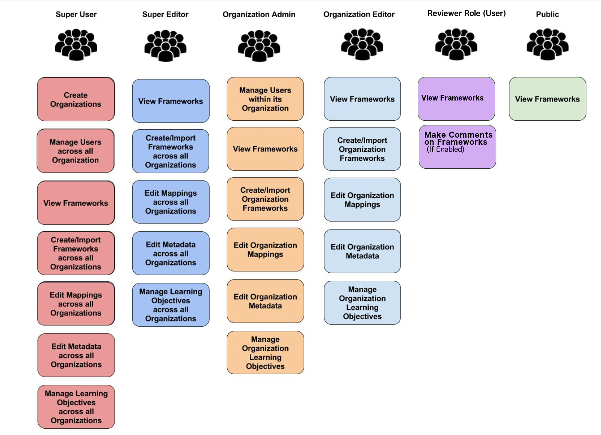

.. |IMG8| image:: static/OpenSALT_User_Manual_8.png
   :height: 141 px
   :width: 188 px

.. |IMG9| image:: static/OpenSALT_User_Manual_9.png
   :height: 102 px
   :width: 624 px

.. |IMG10| image:: static/OpenSALT_User_Manual_10.png
   :height: 81 px
   :width: 624 px

.. |IMG11| image:: static/OpenSALT_User_Manual_11.png
   :height: 82 px
   :width: 622 px

.. |IMG12| image:: static/OpenSALT_User_Manual_12.png
   :height: 73 px
   :width: 624 px

.. |IMG13| image:: static/OpenSALT_User_Manual_13.png
   :height: 29 px
   :width: 129 px

.. |IMG14| image:: static/OpenSALT_User_Manual_14.png
   :height: 57 px
   :width: 624 px

.. |IMG15| image:: static/OpenSALT_User_Manual_15.png
   :height: 78 px
   :width: 622 px

.. |IMG16| image:: static/OpenSALT_User_Manual_16.png
   :height: 73 px
   :width: 624 px

.. |IMG17| image:: static/OpenSALT_User_Manual_17.png
   :height: 60 px
   :width: 624 px

.. |IMG18| image:: static/OpenSALT_User_Manual_18.png
   :height: 76 px
   :width: 624 px

.. |IMG19| image:: static/OpenSALT_User_Manual_19.png
   :height: 60 px
   :width: 624 px

.. |IMG20| image:: static/OpenSALT_User_Manual_20.png
   :height: 129 px
   :width: 174 px

.. |IMG21| image:: static/OpenSALT_User_Manual_21.png
   :height: 116 px
   :width: 485 px

.. |IMG22| image:: static/OpenSALT_User_Manual_22.png
   :height: 157 px
   :width: 210 px

.. |IMG23| image:: static/OpenSALT_User_Manual_23.png
   :height: 150 px
   :width: 624 px

.. |IMG24| image:: static/OpenSALT_User_Manual_24.png
   :height: 36 px
   :width: 105 px

.. |IMG25| image:: static/OpenSALT_User_Manual_25.png
   :height: 154 px
   :width: 624 px

.. |IMG26| image:: static/OpenSALT_User_Manual_26.png
   :height: 120 px
   :width: 584 px

.. |IMG27| image:: static/OpenSALT_User_Manual_27.png
   :height: 128 px
   :width: 624 px

.. |IMG28| image:: static/OpenSALT_User_Manual_28.png
   :height: 89 px
   :width: 624 px

.. |IMG29| image:: static/OpenSALT_User_Manual_29.png
   :height: 150 px
   :width: 624 px

.. |IMG30| image:: static/OpenSALT_User_Manual_30.png
   :height: 88 px
   :width: 624 px

.. |IMG31| image:: static/OpenSALT_User_Manual_31.png
   :height: 154 px
   :width: 624 px

.. |IMG32| image:: static/OpenSALT_User_Manual_32.png
   :height: 154 px
   :width: 624 px

.. |IMG33| image:: static/OpenSALT_User_Manual_33.png
   :height: 24 px
   :width: 624 px

.. |IMG34| image:: static/OpenSALT_User_Manual_33.png
   :height: 24 px
   :width: 624 px

.. |IMG35| image:: static/OpenSALT_User_Manual_34.png
   :height: 86 px
   :width: 624 px

.. |IMG36| image:: static/OpenSALT_User_Manual_31.png
   :height: 154 px
   :width: 624 px

.. |IMG37| image:: static/OpenSALT_User_Manual_35.png
   :height: 266 px
   :width: 557 px

.. |IMG38| image:: static/OpenSALT_User_Manual_36.png
   :height: 268 px
   :width: 560 px

.. |IMG39| image:: static/OpenSALT_User_Manual_37.png
   :height: 265 px
   :width: 557 px

.. |IMG40| image:: static/OpenSALT_User_Manual_38.png
   :height: 265 px
   :width: 558 px

.. |IMG41| image:: static/OpenSALT_User_Manual_39.jpeg
   :height: 173 px
   :width: 565 px

.. |IMG42| image:: static/OpenSALT_User_Manual_40.jpeg
   :height: 217 px
   :width: 573 px

.. |IMG43| image:: static/OpenSALT_User_Manual_41.jpeg
   :height: 468 px
   :width: 446 px

.. |IMG44| image:: static/OpenSALT_User_Manual_42.jpeg
   :height: 357 px
   :width: 678 px

.. |IMG45| image:: static/OpenSALT_User_Manual_43.png
   :height: 505 px
   :width: 533 px

.. |IMG46| image:: static/OpenSALT_User_Manual_44.jpeg
   :height: 285 px
   :width: 662 px

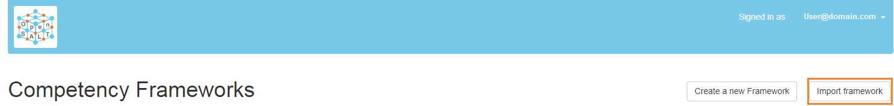

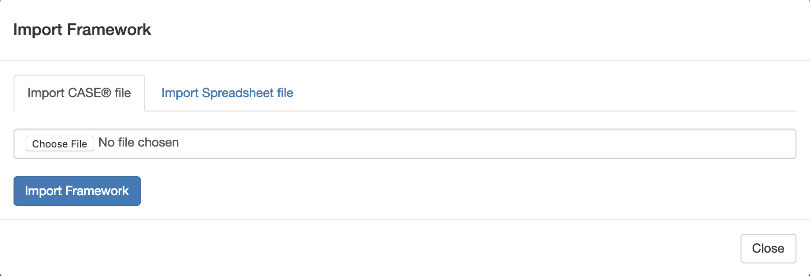

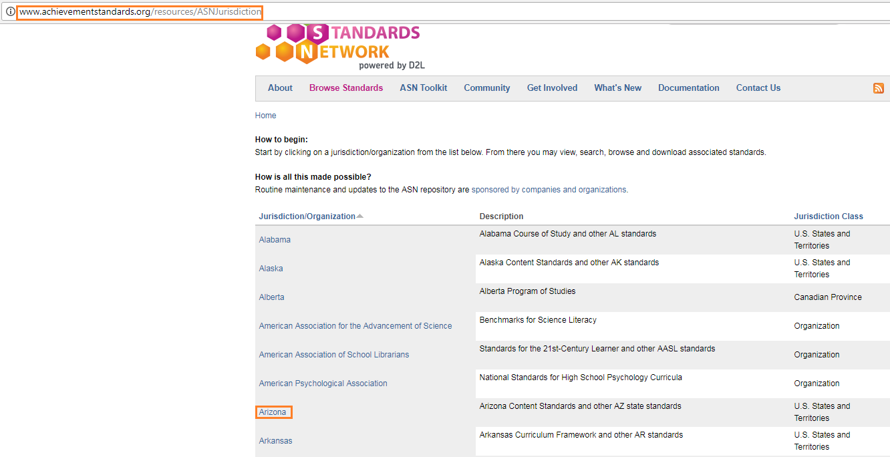

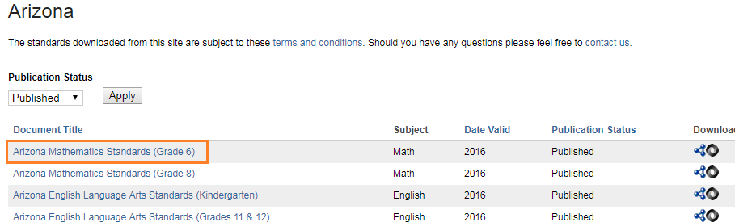

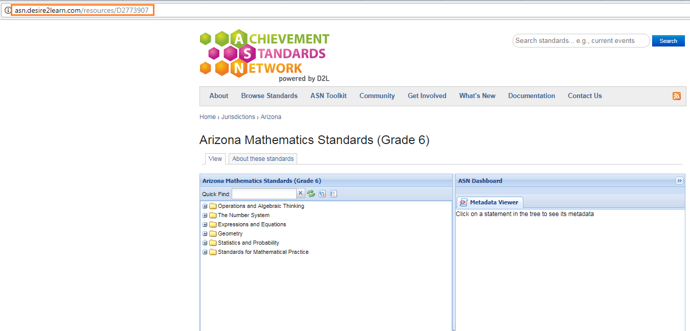

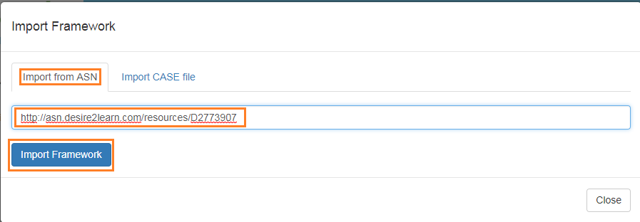

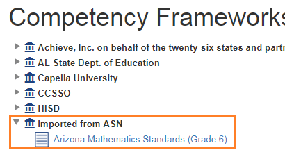

.. |IMG54| image:: static/OpenSALT_User_Manual_52.png
   :height: 173 px
   :width: 472 px

.. |IMG55| image:: static/OpenSALT_User_Manual_53.png
   :height: 185 px
   :width: 624 px

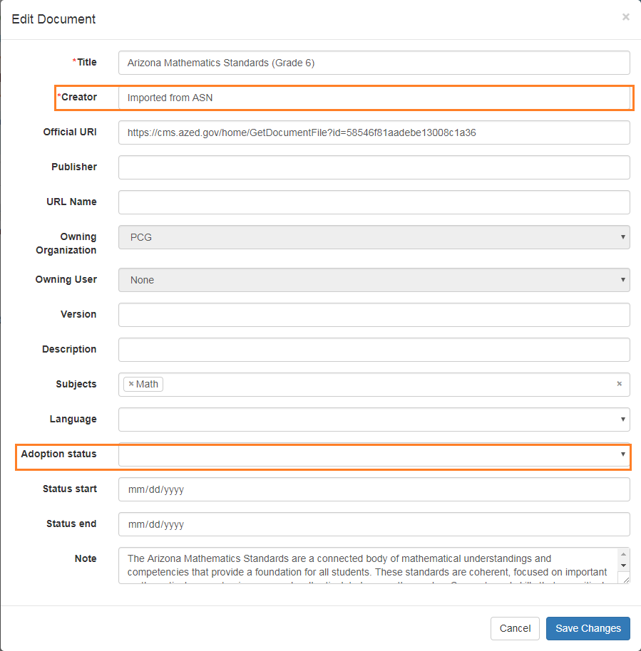

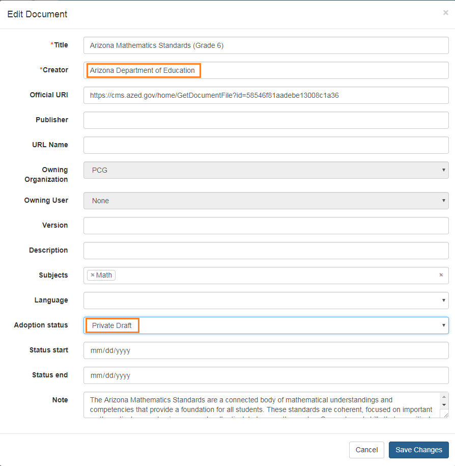

.. |IMG58| image:: static/OpenSALT_User_Manual_56.png
   :height: 181 px
   :width: 521 px

.. |IMG59| image:: static/OpenSALT_User_Manual_57.png
   :height: 268 px
   :width: 530 px

.. |IMG60| image:: static/OpenSALT_User_Manual_58.png
   :height: 170 px
   :width: 489 px

.. |IMG61| image:: static/OpenSALT_User_Manual_59.png
   :height: 121 px
   :width: 234 px

.. |IMG62| image:: static/OpenSALT_User_Manual_60.png
   :height: 358 px
   :width: 624 px

.. |IMG63| image:: static/OpenSALT_User_Manual_61.png
   :height: 392 px
   :width: 624 px

.. |IMG64| image:: static/OpenSALT_User_Manual_62.png
   :height: 105 px
   :width: 624 px

.. |IMG65| image:: static/OpenSALT_User_Manual_52.png
   :height: 178 px
   :width: 485 px

.. |IMG66| image:: static/OpenSALT_User_Manual_53.png
   :height: 185 px
   :width: 624 px

.. |IMG67| image:: static/OpenSALT_User_Manual_63.png
   :height: 522 px
   :width: 513 px

.. |IMG68| image:: static/OpenSALT_User_Manual_64.png
   :height: 224 px
   :width: 325 px

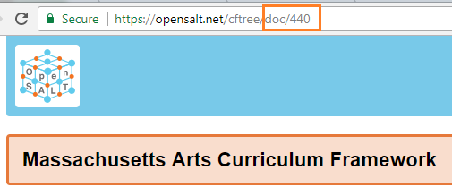

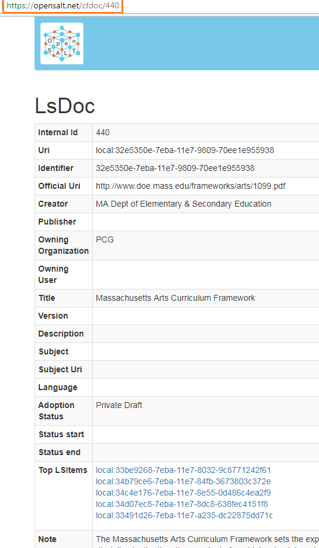

.. |IMG71| image:: static/OpenSALT_User_Manual_67.png
   :height: 570 px
   :width: 329 px

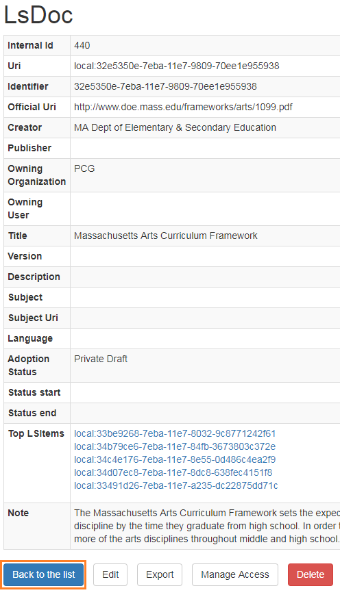

.. |IMG73| image:: static/OpenSALT_User_Manual_69.png
   :height: 49 px
   :width: 120 px

.. |IMG74| image:: static/OpenSALT_User_Manual_70.png
   :height: 89 px
   :width: 422 px

.. |IMG75| image:: static/OpenSALT_User_Manual_71.png
   :height: 152 px
   :width: 538 px

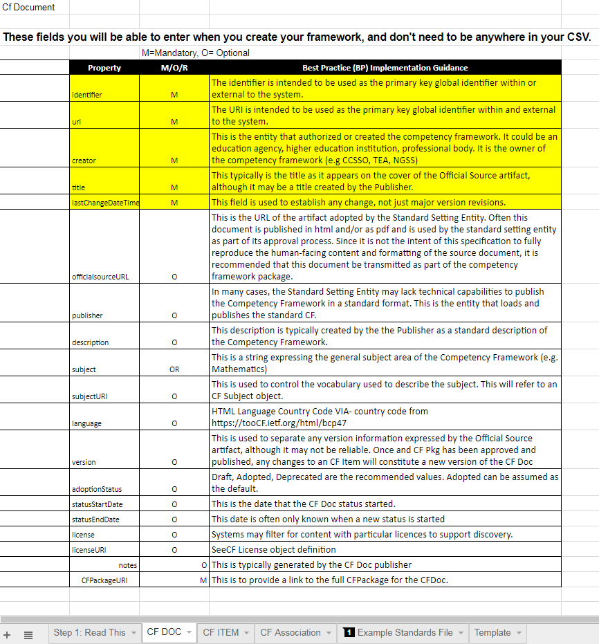

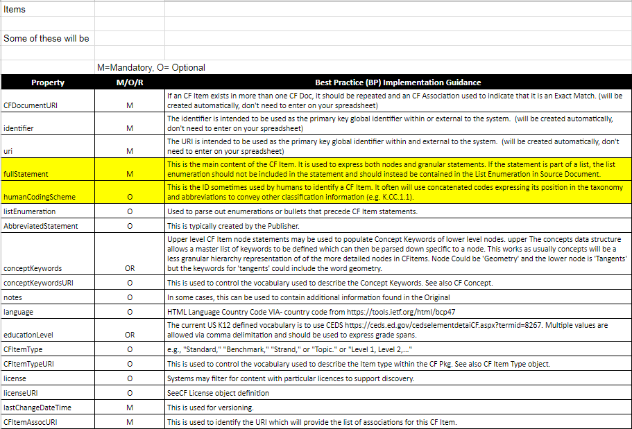

.. |IMG78| image:: static/OpenSALT_User_Manual_74.png
   :height: 304 px
   :width: 682 px

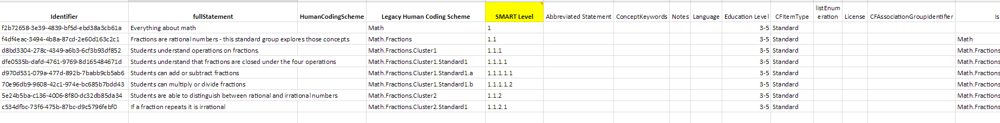

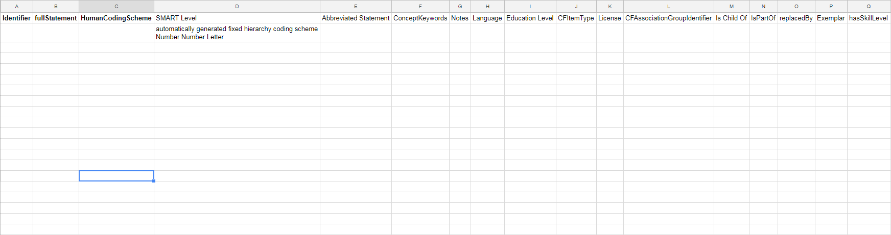

.. |IMG81| image:: static/OpenSALT_User_Manual_77.png
   :height: 192 px
   :width: 624 px

.. |IMG82| image:: static/OpenSALT_User_Manual_78.png
   :height: 344 px
   :width: 566 px

.. |IMG83| image:: static/OpenSALT_User_Manual_79.png
   :height: 220 px
   :width: 601 px

.. |IMG84| image:: static/OpenSALT_User_Manual_80.png
   :height: 265 px
   :width: 588 px

.. |IMG85| image:: static/OpenSALT_User_Manual_81.png
   :height: 304 px
   :width: 609 px

.. |IMG86| image:: static/OpenSALT_User_Manual_82.png
   :height: 156 px
   :width: 460 px

.. |IMG87| image:: static/OpenSALT_User_Manual_83.png
   :height: 172 px
   :width: 624 px

.. |IMG88| image:: static/OpenSALT_User_Manual_84.png
   :height: 40 px
   :width: 624 px

.. |IMG89| image:: static/OpenSALT_User_Manual_85.png
   :height: 93 px
   :width: 624 px

.. |IMG90| image:: static/OpenSALT_User_Manual_86.png
   :height: 302 px
   :width: 358 px

.. |IMG91| image:: static/OpenSALT_User_Manual_87.png
   :height: 62 px
   :width: 434 px

.. |IMG92| image:: static/OpenSALT_User_Manual_88.png
   :height: 29 px
   :width: 29 px

.. |IMG93| image:: static/OpenSALT_User_Manual_89.png
   :height: 18 px
   :width: 624 px

.. |IMG94| image:: static/OpenSALT_User_Manual_90.png
   :height: 30 px
   :width: 30 px

.. |IMG95| image:: static/OpenSALT_User_Manual_91.png
   :height: 26 px
   :width: 624 px

.. |IMG96| image:: static/OpenSALT_User_Manual_92.png
   :height: 28 px
   :width: 32 px

.. |IMG97| image:: static/OpenSALT_User_Manual_93.png
   :height: 57 px
   :width: 624 px

.. |IMG98| image:: static/OpenSALT_User_Manual_94.png
   :height: 28 px
   :width: 30 px

.. |IMG99| image:: static/OpenSALT_User_Manual_95.png
   :height: 53 px
   :width: 624 px

.. |IMG100| image:: static/OpenSALT_User_Manual_96.png
   :height: 29 px
   :width: 34 px

.. |IMG101| image:: static/OpenSALT_User_Manual_97.png
   :height: 62 px
   :width: 624 px

.. |IMG102| image:: static/OpenSALT_User_Manual_98.png
   :height: 34 px
   :width: 36 px

.. |IMG103| image:: static/OpenSALT_User_Manual_99.png
   :height: 57 px
   :width: 624 px

.. |IMG104| image:: static/OpenSALT_User_Manual_100.png
   :height: 28 px
   :width: 28 px

.. |IMG105| image:: static/OpenSALT_User_Manual_101.png
   :height: 78 px
   :width: 624 px

.. |IMG106| image:: static/OpenSALT_User_Manual_102.png
   :height: 32 px
   :width: 29 px

.. |IMG107| image:: static/OpenSALT_User_Manual_103.png
   :height: 122 px
   :width: 624 px

.. |IMG108| image:: static/OpenSALT_User_Manual_104.png
   :height: 29 px
   :width: 30 px

.. |IMG109| image:: static/OpenSALT_User_Manual_105.png
   :height: 29 px
   :width: 30 px

.. |IMG110| image:: static/OpenSALT_User_Manual_106.png
   :height: 29 px
   :width: 30 px

.. |IMG111| image:: static/OpenSALT_User_Manual_107.png
   :height: 185 px
   :width: 624 px

.. |IMG112| image:: static/OpenSALT_User_Manual_108.png
   :height: 430 px
   :width: 496 px

.. |IMG113| image:: static/OpenSALT_User_Manual_109.png
   :height: 241 px
   :width: 590 px

.. |IMG114| image:: static/OpenSALT_User_Manual_110.png
   :height: 252 px
   :width: 617 px

.. |IMG115| image:: static/OpenSALT_User_Manual_111.png
   :height: 254 px
   :width: 624 px

.. |IMG116| image:: static/OpenSALT_User_Manual_112.png
   :height: 296 px
   :width: 584 px

.. |IMG117| image:: static/OpenSALT_User_Manual_113.png
   :height: 382 px
   :width: 440 px

.. |IMG118| image:: static/OpenSALT_User_Manual_114.png
   :height: 285 px
   :width: 562 px

.. |IMG119| image:: static/OpenSALT_User_Manual_115.png
   :height: 301 px
   :width: 624 px

.. |IMG120| image:: static/OpenSALT_User_Manual_116.png
   :height: 264 px
   :width: 581 px

.. |IMG121| image:: static/OpenSALT_User_Manual_117.png
   :height: 361 px
   :width: 414 px

.. |IMG122| image:: static/OpenSALT_User_Manual_118.png
   :height: 196 px
   :width: 456 px

.. |IMG123| image:: static/OpenSALT_User_Manual_119.png
   :height: 233 px
   :width: 302 px

.. |IMG124| image:: static/OpenSALT_User_Manual_120.png
   :height: 233 px
   :width: 304 px

.. |IMG125| image:: static/OpenSALT_User_Manual_121.png
   :height: 261 px
   :width: 576 px

.. |IMG126| image:: static/OpenSALT_User_Manual_122.png
   :height: 104 px
   :width: 508 px

.. |IMG127| image:: static/OpenSALT_User_Manual_123.png
   :height: 305 px
   :width: 586 px

.. |IMG128| image:: static/OpenSALT_User_Manual_124.png
   :height: 129 px
   :width: 564 px

.. |IMG129| image:: static/OpenSALT_User_Manual_125.png
   :height: 214 px
   :width: 602 px

.. |IMG130| image:: static/OpenSALT_User_Manual_126.png
   :height: 185 px
   :width: 604 px

.. |IMG131| image:: static/OpenSALT_User_Manual_127.png
   :height: 284 px
   :width: 624 px

.. |IMG132| image:: static/OpenSALT_User_Manual_128.png
   :height: 337 px
   :width: 449 px

.. |IMG133| image:: static/OpenSALT_User_Manual_129.png
   :height: 124 px
   :width: 372 px

.. |IMG134| image:: static/OpenSALT_User_Manual_130.jpeg
   :height: 348 px
   :width: 553 px

.. |IMG135| image:: static/OpenSALT_User_Manual_131.png
   :height: 168 px
   :width: 624 px

.. |IMG136| image:: static/OpenSALT_User_Manual_132.png
   :height: 149 px
   :width: 624 px

.. |IMG137| image:: static/OpenSALT_User_Manual_133.png
   :height: 229 px
   :width: 624 px

.. |IMG138| image:: static/OpenSALT_User_Manual_134.png
   :height: 230 px
   :width: 624 px

.. |IMG139| image:: static/OpenSALT_User_Manual_135.png
   :height: 301 px
   :width: 573 px

.. |IMG140| image:: static/OpenSALT_User_Manual_136.png
   :height: 250 px
   :width: 624 px

.. |IMG141| image:: static/OpenSALT_User_Manual_137.png
   :height: 201 px
   :width: 397 px

.. |IMG142| image:: static/OpenSALT_User_Manual_138.png
   :height: 145 px
   :width: 289 px

.. |IMG143| image:: static/OpenSALT_User_Manual_139.png
   :height: 290 px
   :width: 266 px

.. |IMG144| image:: static/OpenSALT_User_Manual_140.png
   :height: 186 px
   :width: 293 px

.. |IMG145| image:: static/OpenSALT_User_Manual_141.png
   :height: 272 px
   :width: 278 px

.. |IMG146| image:: static/OpenSALT_User_Manual_142.jpeg
   :height: 342 px
   :width: 492 px

.. |IMG147| image:: static/OpenSALT_User_Manual_143.png
   :height: 237 px
   :width: 580 px

.. |IMG148| image:: static/OpenSALT_User_Manual_144.png
   :height: 342 px
   :width: 624 px

.. |IMG149| image:: static/OpenSALT_User_Manual_145.png
   :height: 186 px
   :width: 568 px

.. |IMG150| image:: static/OpenSALT_User_Manual_146.png
   :height: 170 px
   :width: 624 px

.. |IMG151| image:: static/OpenSALT_User_Manual_147.png
   :height: 204 px
   :width: 624 px

.. |IMG152| image:: static/OpenSALT_User_Manual_148.png
   :height: 249 px
   :width: 624 px

.. |IMG153| image:: static/OpenSALT_User_Manual_149.png
   :height: 261 px
   :width: 624 px

.. |IMG154| image:: static/OpenSALT_User_Manual_150.png
   :height: 172 px
   :width: 548 px

.. |IMG155| image:: static/OpenSALT_User_Manual_151.png
   :height: 181 px
   :width: 584 px

.. |IMG156| image:: static/OpenSALT_User_Manual_152.png
   :height: 252 px
   :width: 624 px

.. |IMG157| image:: static/OpenSALT_User_Manual_138.png
   :height: 116 px
   :width: 289 px

.. |IMG158| image:: static/OpenSALT_User_Manual_153.png
   :height: 189 px
   :width: 624 px

.. |IMG159| image:: static/OpenSALT_User_Manual_154.png
   :height: 212 px
   :width: 624 px

.. |IMG160| image:: static/OpenSALT_User_Manual_140.png
   :height: 186 px
   :width: 293 px

.. |IMG161| image:: static/OpenSALT_User_Manual_155.png
   :height: 334 px
   :width: 624 px

.. |IMG162| image:: static/OpenSALT_User_Manual_156.png
   :height: 133 px
   :width: 429 px

.. |IMG163| image:: static/OpenSALT_User_Manual_157.png
   :height: 296 px
   :width: 624 px

.. |IMG164| image:: static/OpenSALT_User_Manual_158.png
   :height: 390 px
   :width: 624 px

.. |IMG165| image:: static/OpenSALT_User_Manual_156.png
   :height: 133 px
   :width: 429 px

.. |IMG166| image:: static/OpenSALT_User_Manual_159.png
   :height: 269 px
   :width: 558 px

.. |IMG167| image:: static/OpenSALT_User_Manual_160.png
   :height: 245 px
   :width: 624 px

.. |IMG168| image:: static/OpenSALT_User_Manual_161.png
   :height: 284 px
   :width: 624 px

.. |IMG169| image:: static/OpenSALT_User_Manual_162.png
   :height: 321 px
   :width: 624 px

.. |IMG170| image:: static/OpenSALT_User_Manual_163.png
   :height: 313 px
   :width: 520 px

.. |IMG171| image:: static/OpenSALT_User_Manual_164.png
   :height: 244 px
   :width: 624 px

.. |IMG172| image:: static/OpenSALT_User_Manual_165.png
   :height: 345 px
   :width: 624 px

.. |IMG173| image:: static/OpenSALT_User_Manual_145.png
   :height: 186 px
   :width: 568 px

.. |IMG174| image:: static/OpenSALT_User_Manual_146.png
   :height: 170 px
   :width: 624 px

.. |IMG175| image:: static/OpenSALT_User_Manual_147.png
   :height: 204 px
   :width: 624 px

.. |IMG176| image:: static/OpenSALT_User_Manual_166.png
   :height: 234 px
   :width: 624 px

.. |IMG177| image:: static/OpenSALT_User_Manual_167.png
   :height: 284 px
   :width: 624 px

.. |IMG178| image:: static/OpenSALT_User_Manual_168.png
   :height: 181 px
   :width: 570 px

.. |IMG179| image:: static/OpenSALT_User_Manual_169.png
   :height: 180 px
   :width: 624 px

.. |IMG180| image:: static/OpenSALT_User_Manual_170.png
   :height: 313 px
   :width: 624 px

.. |IMG181| image:: static/OpenSALT_User_Manual_169.png
   :height: 180 px
   :width: 624 px

.. |IMG182| image:: static/OpenSALT_User_Manual_170.png
   :height: 313 px
   :width: 624 px

.. |IMG183| image:: static/OpenSALT_User_Manual_156.png
   :height: 133 px
   :width: 429 px

.. |IMG184| image:: static/OpenSALT_User_Manual_171.png
   :height: 194 px
   :width: 624 px

.. |IMG185| image:: static/OpenSALT_User_Manual_172.png
   :height: 229 px
   :width: 573 px

.. |IMG186| image:: static/OpenSALT_User_Manual_173.png
   :height: 249 px
   :width: 624 px

.. |IMG187| image:: static/OpenSALT_User_Manual_174.png
   :height: 270 px
   :width: 624 px

.. |IMG188| image:: static/OpenSALT_User_Manual_175.png
   :height: 200 px
   :width: 505 px

.. |IMG189| image:: static/OpenSALT_User_Manual_176.png
   :height: 249 px
   :width: 624 px

.. |IMG190| image:: static/OpenSALT_User_Manual_177.png
   :height: 249 px
   :width: 624 px

.. |IMG191| image:: static/OpenSALT_User_Manual_178.png
   :height: 269 px
   :width: 624 px

.. |IMG192| image:: static/OpenSALT_User_Manual_179.png
   :height: 62 px
   :width: 292 px

.. |IMG193| image:: static/OpenSALT_User_Manual_180.png
   :height: 61 px
   :width: 829 px

.. |IMG194| image:: static/OpenSALT_User_Manual_181.png
   :height: 332 px
   :width: 624 px

.. |IMG195| image:: static/OpenSALT_User_Manual_182.png
   :height: 337 px
   :width: 417 px

.. |IMG196| image:: static/OpenSALT_User_Manual_183.png
   :height: 248 px
   :width: 624 px

.. |IMG197| image:: static/OpenSALT_User_Manual_184.png
   :height: 249 px
   :width: 624 px

.. |IMG198| image:: static/OpenSALT_User_Manual_185.png
   :height: 262 px
   :width: 624 px

.. |IMG199| image:: static/OpenSALT_User_Manual_186.png
   :height: 278 px
   :width: 484 px

.. |IMG200| image:: static/OpenSALT_User_Manual_187.png
   :height: 85 px
   :width: 218 px

.. |IMG201| image:: static/OpenSALT_User_Manual_188.png
   :height: 165 px
   :width: 624 px

.. |IMG202| image:: static/OpenSALT_User_Manual_189.png
   :height: 148 px
   :width: 625 px

.. |IMG203| image:: static/OpenSALT_User_Manual_190.png
   :height: 148 px
   :width: 624 px
